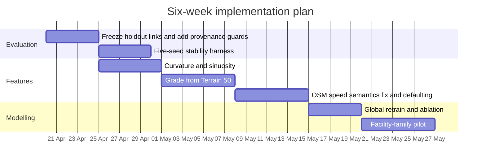

# Technical audit and action plan for road_risk_analysis

## Executive summary

The current code does **not** show active training-time leakage from `pct_dark`, `pct_urban`, `pct_junction`, or collision-derived `mean_speed_limit` into the Stage 2 GLM or XGBoost feature lists. However, those variables are **definitely** created from snapped collision records in `build_road_link_annual()`, written into `road_link_annual.parquet`, and then merged into the Stage 2 base dataframe in `build_collision_dataset()`. In other words: the provenance problem is real, but for these four columns it is currently a **latent leakage/provenance bug**, not a demonstrated active feature-leakage bug in the present training code. citeturn29view0turn29view1turn27view0turn27view1turn28view0

The repo has improved materially. The old `features.py` path now explicitly warns that it is deprecated and would create a biased collision-positive-only training table if run directly. Stage 2 XGBoost now uses `GroupShuffleSplit` by `link_id`, which is the right direction for avoiding repeated-year leakage across train and test. The repo/TODO also documents recent fixes to stale R² reporting, OSM cache behaviour, and the police-force-code issue. Those changes reduce several earlier criticisms. citeturn34view0turn34view1turn27view1turn10view2turn13view1

The biggest remaining technical issue is **not** the latent `pct_*` columns. It is the semantics of the current OSM speed feature. In `network_features.py`, the extractor calls `ox.add_edge_speeds()` and then promotes `speed_kph` to `speed_limit_mph`; entity["organization","OSMnx","python library"] documents `add_edge_speeds()` as a mean-imputation of free-flow edge speeds from observed `maxspeed` by highway type, not a clean raw posted-speed tag. So the current column labelled `speed_limit_mph` is not a clean “OSM maxspeed” feature. Before doing any “OSM retrain” or road-class-tiered imputation work, I would fix that extraction semantics first. citeturn39view0turn38search0

If the goal is model improvement rather than only rank stabilisation, the strongest next moves are: first, freeze a robust evaluation harness; second, add **full-coverage geometry features** from entity["organization","Ordnance Survey","uk mapping agency"] data, especially curvature/sinuosity and then DEM-based grade; third, repair the OSM speed extractor and only then test speed defaults and OSM enrichment. A facility-family split is still worth doing, but only after you can attribute gains cleanly. citeturn22search1turn22search0turn14view1turn14view0turn14view2

On the literature point, the exact M25 **severity** paper is **Quddus, Wang and Ison (2010)**, not Wang-first-author. If the prior critique referred to a “Wang, Quddus and Ison M25 severity paper”, that wording was imprecise. The Wang-first-author M25 paper is the 2009 accident-frequency paper; the Wang-first-author 2011 paper is the two-stage severity-level frequency/site-ranking paper, not the exact M25 severity paper. citeturn16search0turn16search1turn16search20turn15search4turn15search1turn15search14

## Leakage evidence

The precise code trail is below.

| File path | Function | Lines | Evidence | Audit verdict |
|---|---|---:|---|---|
| `src/road_risk/join.py` | `build_road_link_annual()` | 2825–2890 | The function derives `_is_dark`, `_is_urban`, `_at_junction` from snapped collision rows and aggregates them into `pct_dark`, `pct_urban`, `pct_junction`; it also computes `"mean_speed_limit"`. Representative lines include `"pct_dark=("_is_dark", "mean")"` and `"mean_speed_limit=("speed_limit", ...)"`. citeturn29view0turn29view1 | **Collision-derived columns are created here.** |
| `src/road_risk/join.py` | `build_road_link_annual()` | 2753–2810, 2906–3013 | The table is built by aggregating snapped collisions by `link_id, year`, then left-joining road features, then saving to `road_link_annual.parquet`. This means `road_link_annual` is collision-aggregate-first, not a clean pre-collision feature store. citeturn29view0turn29view1 | **Real provenance contamination risk.** |
| `src/road_risk/model/collision.py` | `build_collision_dataset()` | 1457–1472 | Stage 2 explicitly pulls `pct_dark`, `pct_urban`, `pct_junction`, `pct_near_crossing`, `mean_speed_limit`, and `hgv_proportion` from `rla`, trims to `rla_cols`, and left-merges into the Stage 2 base table via `base.merge(...)`. citeturn6view0turn28view0 | **Those columns do enter the Stage 2 base dataframe.** |
| `src/road_risk/model/collision.py` | `train_collision_glm()` | 1603–1657 | The GLM feature lists include road-class/form-of-way flags plus network candidates such as `hgv_proportion`, `degree_mean`, `betweenness*`, `dist_to_major_km`, `pop_density_per_km2`, `speed_limit_mph`, `lanes`, and `is_unpaved`. They do **not** include `pct_dark`, `pct_urban`, `pct_junction`, or `mean_speed_limit`. citeturn27view0 | **No active GLM leakage evidence for the four queried columns.** |
| `src/road_risk/model/collision.py` | `train_collision_xgb()` | 1763–1795 | The XGBoost feature list likewise includes `estimated_aadt`, `hgv_proportion`, network features, and OSM columns such as `speed_limit_mph`, `lanes`, `is_unpaved`, but not `pct_dark`, `pct_urban`, `pct_junction`, or `mean_speed_limit`. citeturn27view1 | **No active XGB leakage evidence for the four queried columns.** |
| `src/road_risk/model/collision.py` | `score_and_save()` | 1990–2055 | The pooled output still carries `pct_dark`, `pct_urban`, and `pct_junction` into `risk_scores.parquet` if present, using `"first"` within link-level aggregation. citeturn27view2turn28view0 | **Not a training leak, but semantically weak output design.** |
| `src/road_risk/features.py` | module warning | 1483–1489 | The file warns it is “not part of the current pipeline” and that running it directly will produce “a biased training table (collision-positive links only)”. citeturn34view0turn34view1 | **This earlier failure mode is now explicitly guarded.** |

The correct bottom line is therefore:

- `pct_dark`, `pct_urban`, `pct_junction`, and `mean_speed_limit` are **created from collisions** and **merged into Stage 2 inputs**. citeturn29view0turn29view1turn6view0
- I found **no evidence** that those four variables are currently consumed by the Stage 2 GLM or XGBoost training feature lists. citeturn27view0turn27view1
- So the prior criticism should be narrowed from “active leakage bug” to **“bad feature provenance and latent leakage risk that should be structurally removed before future retrains.”** citeturn6view0turn27view2turn34view1

A related clarification: `hgv_proportion` is **not** collision-derived in the current pipeline. It is carried through the AADF road-features join in `join.py`, then optionally used by the Stage 2 model. Coverage and missingness are still issues, but it is not the same provenance problem as the `pct_*` columns. citeturn8view0turn8view2turn27view0turn27view1turn13view1

## Citation verification

The exact M25 **severity** paper is:

**Quddus, Mohammed A.; Wang, Chao; Ison, Stephen G. (2010). “Road Traffic Congestion and Crash Severity: Econometric Analysis Using Ordered Response Models.” Journal of Transportation Engineering, 136(5), 424–435. DOI: 10.1061/(ASCE)TE.1943-5436.0000044.** It studies crash severity on the M25 motorway and is the correct citation if the prior critique meant the M25 severity paper. citeturn16search0turn16search1turn16search20

If someone specifically wrote “**Wang, Quddus and Ison** M25 severity paper”, that is still ambiguous because the exact severity paper has **Quddus** as first author. The closest Wang-first-author candidates are:

| Candidate | Match status | Why it is not the exact same paper |
|---|---|---|
| **Wang, Chao; Quddus, Mohammed A.; Ison, Stephen G. (2009). “Impact of traffic congestion on road accidents: a spatial analysis of the M25 motorway in England.” Accident Analysis & Prevention, 41(4), 798–808. DOI: 10.1016/j.aap.2009.04.002.** citeturn15search4turn15search16 | Close but not exact | M25 paper, Wang first author, but this is primarily about **accident frequency**, not crash severity. |
| **Wang, Chao; Quddus, Mohammed A.; Ison, Stephen G. (2011). “Predicting accident frequency at their severity levels and its application in site ranking using a two-stage mixed multivariate model.” Accident Analysis & Prevention, 43(6), 1979–1990. DOI: 10.1016/j.aap.2011.05.016.** citeturn15search1turn15search14 | Related but not exact | Wang first author and about severity-level frequencies/site ranking, but not the exact M25 severity paper. |

So the citation is verifiable, but the author-order shorthand matters.

## Feature augmentation feasibility

Two facts matter before ranking feature candidates. First, the repo already has a working OSM feature-extraction path using county `.osm` files from entity["company","Geofabrik","openstreetmap download provider"], county checkpointing, and a nearest spatial join from OSM edges to OS Open Roads links. Second, the current implementation has a semantic flaw for speed: it calls `ox.add_edge_speeds()` and then stores `speed_kph` as `speed_limit_mph`, even though OSMnx documents that field as imputed free-flow speed, not a pure posted-speed tag. That means any “OSM speed limit” experiment should begin by fixing the extractor, not by immediately retraining. citeturn37view1turn37view0turn38search0turn20search2turn20search6

A separate documentation problem is that the repo currently reports **inconsistent OSM coverage numbers**. The README says speed 43.6%, lanes 5.5%, surface 12.8%, while TODO says speed 56%, lanes 7%, `is_unpaved` 16%. That inconsistency is not fatal, but it means the current feature-coverage story is not yet audit-clean. citeturn10view2turn12view1

### Feasibility table

| Feature | Source documents | Coverage and attachment strategy | Computational path | Rough cost | Predictive value | Priority |
|---|---|---|---|---|---|---|
| **Posted speed limit** | entity["organization","OpenStreetMap","mapping project"] `maxspeed` and default-speed documentation; Geofabrik GB/England extracts. citeturn20search7turn20search3turn20search2turn20search6 | **Current repo column:** roughly 43.6–56%, but that reflects current extractor semantics and spatial matching, not necessarily explicit raw `maxspeed` coverage. Recommended join: robust OS Open Roads ↔ OSM line matching with saved `osm_way_id`, match distance, and source flag. citeturn10view2turn12view1turn39view0turn37view0 | Parse raw `maxspeed`; store `maxspeed_raw`, `speed_limit_mph_explicit`, `speed_limit_source`; only after that apply UK-default or road-class-tiered defaults. | Dev: 1–2 days. Run: 30–120 min. Temp disk can be several GB because the current pipeline expands `.osm.pbf` to `.osm` and writes county partial parquets. citeturn37view1turn20search6 | High, but only if semantics are fixed first. | **Very high** |
| **Lane count** | OSM `lanes` tagging; same Geofabrik extracts. citeturn21search1turn20search6 | Current repo reports roughly 5.5–7% overall. Best attached through the same OS↔OSM line match as speed. citeturn10view2turn12view1turn37view0 | Parse integer `lanes`; store `lanes_raw`, `lanes_explicit`, optional defaulted `lanes_final` plus `_imputed` flag. | Incremental once OSM pass exists. Final storage small. | Moderate on motorways/A roads; weaker on minor roads unless family-specific. | Medium |
| **Curvature / sinuosity** | OS Open Roads geometry from entity["organization","Ordnance Survey","uk mapping agency"]. citeturn22search1turn14view1 | Near-universal, because derived directly from each LineString and keyed by `link_id`. | Resample links every 10–25 m, compute turning angles, summarise `mean_curvature`, `max_curvature`, `sinuosity`. | Dev: 1 day. Run: 30–90 min for 2.1M links. Final parquet typically tens of MB to low hundreds of MB. | High-moderate and cleanest full-network uplift candidate. | **Very high** |
| **Gradient / elevation change** | OS Terrain 50 plus OS Open Roads. citeturn22search0turn22search1turn14view0 | Near-universal in Great Britain, keyed by `link_id` after sampling the DEM along each link. Bridges/tunnels need caution. citeturn22search0turn14view0 | Sample Terrain 50 elevations at resampled points; derive `mean_grade`, `max_grade`, `grade_change`; mask or flag OSM `bridge`/`tunnel` where possible. | Dev: 1–2 days. Run: 1–3 h if windowed raster sampling is used. | Moderate; especially useful with curvature and HGV interactions. | **High** |
| **Junction complexity** | OS Open Roads graph topology plus OSM `highway=traffic_signals`. citeturn24view0turn24view2turn23search0turn23search3 | Base arm-count / node-degree coverage is effectively network-wide because start/end nodes already exist; signalisation coverage depends on OSM completeness. | Extend existing graph features from mean degree to endpoint arm count, max arm count, roundabout approach flag, nearby signals count. | Dev: 0.5–1 day. Run: 15–60 min. | Moderate and more interpretable than generic `degree_mean`. | **High** |
| **Lighting presence** | OSM `lit`. citeturn21search2 | Coverage is currently **not reliably measured** in the repo because the logger counts `lit == True`, not non-null tag coverage. Expect urban/classified-road bias. citeturn37view0 | Add `lit_explicit`, `lit_present`, `lit_source`; report true non-null coverage before deciding on modelling. | Incremental on same OSM pass. | Moderate for night-risk or severity modelling; weaker for all-collisions global model. | Medium-low |
| **Footway / pavement presence** | OSM `sidewalk=*`, `sidewalk:left/right/both=*`, and `highway=footway + footway=sidewalk`. citeturn21search0turn21search3turn21search17turn21search13turn23search5 | No repo diagnostic yet. Likely useful mainly on urban streets; low value on motorways and rural single carriageways. | Extract any sidewalk indicator into `has_sidewalk`; optionally count parallel sidewalk ways within a narrow buffer. | Incremental on OSM pass. | Moderate for pedestrian-risk submodels; weak for all-collision global target. | Low for global model, high for future urban/pedestrian split |

### Recommended extraction patterns

The code below is the shape I would implement next. It is pseudocode, but close to production.

```python
# OSM attributes: keep raw tags and provenance separate
edges["maxspeed_raw"] = edges.get("maxspeed")
edges["lanes_raw"] = edges.get("lanes")
edges["lit_raw"] = edges.get("lit")
edges["sidewalk_raw"] = (
    edges.get("sidewalk")
    .fillna(edges.get("sidewalk:left"))
    .fillna(edges.get("sidewalk:right"))
    .fillna(edges.get("sidewalk:both"))
)

edges["speed_limit_mph_explicit"] = parse_osm_maxspeed(edges["maxspeed_raw"])
edges["has_explicit_speed"] = edges["speed_limit_mph_explicit"].notna()
edges["lanes_explicit"] = parse_lanes(edges["lanes_raw"])
edges["lit_present"] = parse_lit(edges["lit_raw"])
edges["has_sidewalk"] = parse_sidewalk(edges["sidewalk_raw"])

# Better OS ↔ OSM matching than centroid nearest:
# candidate lines within 30–50m, then choose best by overlap, bearing, and distance.
matches = match_lines(
    os_open_roads_links,
    osm_ways,
    max_distance_m=50,
    use_bearing=True,
    use_overlap=True,
)
```

```python
# Curvature and sinuosity from OS Open Roads geometry
pts = resample_linestring(link.geometry, spacing_m=15)
angles = turning_angles(pts)                 # change in heading between successive segments
mean_curv = np.abs(angles).sum() / link.length_km
max_curv = np.abs(angles).max()
sinuosity = link.length_m / straight_line_distance(link.geometry)
```

```python
# Grade from Terrain 50
pts = resample_linestring(link.geometry, spacing_m=25)
z = sample_dem(terrain50_raster, pts)
grade = np.diff(z) / np.diff(cumulative_distance(pts))
mean_grade = np.nanmean(np.abs(grade))
max_grade = np.nanmax(np.abs(grade))
grade_change = np.nansum(np.abs(np.diff(z)))
```

```python
# Junction complexity using existing graph + OSM signals
G = build_graph(openroads)  # existing code path
node_deg = dict(G.degree())
openroads["start_deg"] = openroads["start_node"].map(node_deg)
openroads["end_deg"] = openroads["end_node"].map(node_deg)
openroads["max_arm_count"] = openroads[["start_deg", "end_deg"]].max(axis=1)

signals = load_osm_points("highway=traffic_signals")
openroads["near_signal"] = endpoint_buffer_join(openroads, signals, distance_m=15)
```

### Priority ordering

If the objective is **best lift per unit effort**, my order is:

| Feature | Expected gain | Coverage quality | Implementation risk | Recommended order |
|---|---|---:|---:|---:|
| Curvature / sinuosity | High-moderate | Near 100% | Low | **First** |
| Grade / elevation | Moderate | Near 100% | Medium | **Second** |
| Speed limit semantics fix + defaults | High if done cleanly | Good after defaults | Medium-high | **Third** |
| Junction complexity | Moderate | High | Low | Fourth |
| Lane count | Moderate on SRN/A roads | Low overall today | Medium | Fifth |
| Lighting | Niche but real | Unknown / unmeasured | Low | Sixth |
| Footway | Useful mainly in urban/pedestrian contexts | Unknown | Medium | Seventh |

## Sequencing and experiment design

If you implement “OSM retrain” and “facility-family split” together, you will **not** be able to attribute improvement cleanly. The right design is a frozen 2×2 experiment on the same held-out links. The current repo already uses grouped link-level splitting for XGBoost; keep that principle, but make the benchmark explicit and reusable across all variants. citeturn27view1turn13view1turn14view2

With 2,167,557 links in the current repo and only three measured AADF years currently available for the exposure model, a 20% frozen holdout is still very large: roughly 433k links and about 1.3M link-years. That is ample for stable out-of-sample ranking metrics, and you should reuse the **same** holdout link IDs across every model variant. citeturn10view2turn10view0

### Recommended attribution design

| Model | Feature set | Architecture | Purpose |
|---|---|---|---|
| **M0** | Current baseline | Single global Stage 2 model | Benchmark |
| **M1** | M0 + fixed OSM speed semantics / selected OSM enrichments | Single global model | Main effect of OSM |
| **M2** | M0 features only | Facility-family split | Main effect of architecture |
| **M3** | M1 features | Facility-family split | Interaction effect |

Run all four on the same frozen holdout. The comparisons you want are straightforward:

- **M1 − M0** = what OSM bought you on the current architecture.
- **M2 − M0** = what family splitting bought you without OSM.
- **M3 − M2** = what OSM buys you **after** family splitting.
- **M3 − M1** = what family splitting buys you **after** OSM.
- If `(M3 − M2) ≠ (M1 − M0)`, you have a real interaction and should not report a single generic “OSM gain”.

### Metrics and validation protocol

Use the following, in this order:

1. **Primary ranking metric**: observed collision-rate lift in the top 1%, top 0.5%, and top 0.1% of held-out links.
2. **Secondary fit metrics**: Poisson deviance and pseudo-R² on the same holdout.
3. **Calibration**: observed vs predicted by risk decile, both overall and by family.
4. **Stability**: top-k Jaccard and Spearman rank correlation across 5 random seeds.
5. **Family diagnostics**: family-wise residual distributions, especially motorway and trunk A-road families. citeturn12view1turn14view0turn31search2turn31search6turn31search16

My recommendation is therefore:

- **Before either OSM or family splitting**: implement the 5-seed/frozen-holdout evaluation harness.
- **Among those two options**: do **OSM-only first** on the global model, because it is a smaller and more attributable perturbation.
- **Only then** run the family-split experiment on the winning feature set.

That is slightly different from the broad TODO dependency logic, which is sensible for a long roadmap but not ideal if the immediate question is “which one actually improved the model?”. citeturn14view2

### Implementation timeline



## Repo and TODO review

The repo is in better shape than the website. The current README describes a 2,167,557-link network, Stage 1a/1b/2, April 2026 key results, and explicit data-quality notes; the website homepage still reads more like a Yorkshire-pilot methodology site and does not reflect the current full-area metrics or the latest OSM-specific caveats. In practice, the README is now the more up-to-date technical source of truth. citeturn10view0turn10view2turn11view0

Several previously flagged issues have clearly been reduced:

- the deprecated `features.py` path now warns against collision-positive-only training; citeturn34view0
- Stage 2 XGBoost uses grouped link-level splitting; citeturn27view1
- the repo documents fixes to stale R² reporting and OSM cache behaviour; citeturn13view1
- the TODO records that OSM global retraining without better imputation has been deliberately parked rather than blindly pursued. citeturn13view3

That said, the TODO is only **partly** the right next-step list. Its dependency logic is mostly sound, but I would change the order and add two missing hardening tasks.

### What the TODO gets right

The TODO is right to avoid a naive global OSM retrain, right to put evaluation infrastructure high on the stack, and right to delay SRN-specific network-model integration until after a facility-family split. Those choices are technically defensible. citeturn13view3turn12view1turn14view0turn14view2

### What I would change

The first missing task is **feature-provenance hardening**. Right now collision-derived context columns are still present in the Stage 2 base dataframe and partly in final output, even though they are not active training features today. That should be fixed before any more ambitious retrains. citeturn6view0turn27view2turn28view0

The second missing task is **OSM speed semantics repair**. The current code calls `graph_from_xml(..., retain_all=False)`, which OSMnx documents as keeping only the largest weakly connected component, then calls `add_edge_speeds()`, then writes those inferred speeds into `speed_limit_mph`. That combination can both distort meaning and suppress coverage on disconnected fragments. Until that is fixed, the TODO’s OSM-speed workstream is slightly pointed at the wrong object. citeturn39view0turn41search0

Third, I would move **curvature** and then **grade** ahead of IMD and NaPTAN if the goal is better predictive signal. IMD and bus-stop buffers are fine additions, but they are partial-context enrichments. Curvature and grade attack a more central omission in the current model: full-network road geometry. citeturn14view1turn14view0turn14view2

### Concrete PR suggestions

**PR one — provenance hardening in Stage 2**

- File: `src/road_risk/model/collision.py`
- Change: define a `FORBIDDEN_POST_EVENT_COLS` set containing `pct_dark`, `pct_urban`, `pct_junction`, `pct_near_crossing`, `mean_speed_limit`.
- Change: allow those columns only in a separate diagnostics frame, not in the training dataframe.
- Change: add an assertion that no forbidden column appears in `glm_features` or `xgb_features`.
- Change: stop carrying `pct_dark`, `pct_urban`, `pct_junction` into `risk_scores.parquet`, or save them to `risk_diagnostics.parquet` with year-aware aggregation instead of `"first"`. citeturn6view0turn27view2turn28view0

**PR two — repair OSM speed extraction**

- File: `src/road_risk/network_features.py`
- Change: do **not** use `speed_kph` as the posted-speed feature.
- Change: preserve raw `maxspeed`; create `speed_limit_mph_explicit`.
- Change: add `speed_limit_source` with values such as `explicit_osm`, `default_by_class`, `missing`.
- Change: fix `parse_speed()` so `km/h` is converted by units, not by a value-threshold heuristic.
- Change: set `retain_all=True` when reading OSM XML unless there is a deliberate reason not to.
- Change: log both **non-null coverage** and **`True` prevalence** for boolean tags like `lit`. citeturn39view0turn37view0turn38search0turn41search0

**PR three — better OSM ↔ OS matching**

- File: `src/road_risk/network_features.py`
- Change: replace centroid-nearest-only matching with candidate OSM lines within 50 m, then choose by overlap length, bearing difference, and distance.
- Change: persist `osm_way_id`, `match_distance_m`, and `match_score` for auditing. citeturn37view0

**PR four — geometry feature module**

- File: new `src/road_risk/geometry_features.py`, then merge into `network_features.py`
- Change: compute `sinuosity`, `mean_curvature`, `max_curvature`, followed by `mean_grade`, `max_grade`, `grade_change`.
- Change: cache resampled link points so grade can reuse curvature geometry work. citeturn14view1turn14view0turn22search0turn22search1

**PR five — documentation synchronisation**

- Files: `README.md`, `TODO.md`, website Quarto pages
- Change: reconcile OSM coverage numbers.
- Change: make one place the authoritative “current metrics” source.
- Change: update the site so it no longer reads as an older Yorkshire-only prototype while the repo README describes a much larger multi-region pipeline. citeturn10view2turn12view1turn11view0

On balance, the TODO is **directionally good**, but I would amend it to:

1. add provenance hardening;
2. add OSM speed-semantics repair;
3. move curvature/grade up;
4. then do global retrain ablations;
5. only afterwards do facility-family split.

## Literature linkage and reading list

I did not identify any obvious web-indexed scholarly citations to the repo or site during this audit. That is not surprising for a young GitHub-first project. The immediate bottleneck is not lack of reading material; it is feature provenance, extraction semantics, and evaluation discipline.

### Prioritised reading list

| Priority | Reference | Why it matters here |
|---|---|---|
| Highest | **Quddus, M. A., Wang, C., & Ison, S. G. (2010). _Road Traffic Congestion and Crash Severity: Econometric Analysis Using Ordered Response Models_. Journal of Transportation Engineering, 136(5), 424–435. DOI 10.1061/(ASCE)TE.1943-5436.0000044.** citeturn16search0turn16search20 | The exact M25 severity paper and the closest thematic match to your motorway-severity questions. |
| Highest | **Wang, C., Quddus, M. A., & Ison, S. G. (2011). _Predicting accident frequency at their severity levels and its application in site ranking using a two-stage mixed multivariate model_. Accident Analysis & Prevention, 43(6), 1979–1990. DOI 10.1016/j.aap.2011.05.016.** citeturn15search1turn15search14 | Directly relevant to your multi-stage design and ranking use-case. |
| High | **Wang, C., Quddus, M. A., & Ison, S. G. (2009). _Impact of traffic congestion on road accidents: a spatial analysis of the M25 motorway in England_. Accident Analysis & Prevention, 41(4), 798–808. DOI 10.1016/j.aap.2009.04.002.** citeturn15search4turn15search16 | Same corridor, same author set, useful benchmark for modelling choices and interpretation. |
| High | **Michalaki, P., Quddus, M. A., Pitfield, D., & Huetson, A. (2015). _Exploring the factors affecting motorway accident severity in England using the generalised ordered logistic regression model_. Journal of Safety Research, 55, 89–97. DOI 10.1016/j.jsr.2015.09.004.** citeturn40search0turn40search1 | Strongly relevant for motorway severity determinants, including speed and traffic conditions. |
| High | **entity["organization","Federal Highway Administration","us transport safety agency"] (2017). _Screening Your Network to Improve Roadway Safety Performance – Getting Started_.** citeturn31search2 | Good operational reference for your ranking/screening use-case. |
| High | **entity["organization","Federal Highway Administration","us transport safety agency"] (2011). _Project Evaluation Using Empirical Bayes_.** citeturn31search6 | Short official grounding for the EB task already in your TODO. |
| Medium | **entity["book","Highway Safety Manual","aashto 1st edition"], Network Screening chapter.** citeturn31search16 | The classic reference for site-type-specific safety performance functions and EB logic. |
| Medium | **Huda, K. T., & Al-Kaisy, A. (2024). _Network Screening on Low-Volume Roads Using Risk Factors_.** citeturn31search10 | Useful because your project is trying to score sparse-data, low-count roads where pure hotspot methods struggle. |

If you want the shortest useful reading stack rather than a long bibliography, I would read in this exact order: **Quddus 2010**, **Wang 2011**, **FHWA network screening**, **FHWA empirical Bayes**, **Michalaki 2015**. That set is directly aligned to your current modelling decisions and TODO structure.