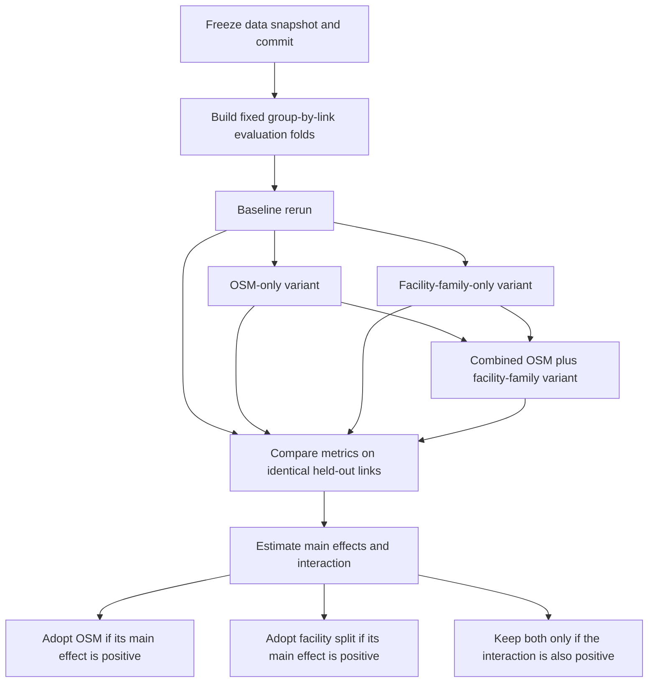

# Repository verification and experiment roadmap for road_risk_analysis

## Executive summary

On the latest visible `main` branch, the repository and site updates do reduce several of the issues you raised, but mostly by fixing pipeline structure and documentation rather than by already delivering the next round of predictive lift. The strongest confirmed improvements are these: the old collision-positive-only path in `features.py` is now explicitly deprecated; Stage 2 now rebuilds an all-links × years table and keeps zero-collision rows; Stage 1a now explicitly excludes WebTRIS-derived features from AADT training; and the site/README now clearly state that the GLM and XGBoost pseudo-R² values are not directly comparable. The most important unresolved technical point is that collision-derived STATS19 context columns are still created in `join.py` and merged into the Stage 2 base dataframe in `collision.py`, but I found no evidence on current `main` that they enter the active GLM or XGBoost feature matrices. That means the present risk is **latent leakage / dataframe pollution**, not an active training-leakage bug in the current model code. citeturn37view0turn15view0turn16view0turn6view4turn17view3turn34view0

The paper reference from the prior critique also needs correction. The real crash-severity paper is **Quddus, Wang and Ison (2010)**, not “Wang, Quddus and Ison”; and the real **Wang-first M25 paper** is a different 2009 paper about accident frequency/congestion on the M25. In other words, the earlier critique appears to have conflated two adjacent papers by the same authors. citeturn26view1turn27search11turn27search14turn36search0

Your updated TODO is much more operational than the earlier advice. It now has explicit dependencies, a sensible execution order, and a much better treatment of the OSM question: the repo now records a full-area OSM enrichment run and cache fix, but also explicitly parks a naive “global OSM retrain” because the current coverage diagnostic says no road-class slice reaches 80% coverage. That is a meaningful improvement in judgement, not just in prose. citeturn34view1turn34view2turn31view4turn7view0

The practical recommendation is straightforward: **do not bundle OSM and facility-family splitting into the same first experiment**. Freeze the baseline first, then run a four-arm ablation under identical held-out link splits: baseline, OSM-only, facility-split-only, and both together. That is the only clean way to attribute gains and estimate interaction effects rather than just reporting a better number. Your own TODO already points in that direction by making stability infrastructure and dependency management explicit. citeturn7view0turn34view1

## Collision-derived feature verification

The code paths below are the operative ones I could verify directly on the current repo state. The latest visible file commits I used were `7cbcc16` for `src/road_risk/join.py` and `36d26c5` for `src/road_risk/model/collision.py`. The repo-level latest visible commit on `main` is `ab71ea1` on 19 April 2026. citeturn29view0turn28view0turn37view0

| File and function | Latest visible file commit | Exact lines verified | What it demonstrates | Leakage verdict |
|---|---:|---|---|---|
| `src/road_risk/join.py::build_road_link_annual()` | `7cbcc16` | `pct_dark=("_is_dark", "mean")`, `pct_urban=("_is_urban", "mean")`, `pct_junction=("_at_junction", "mean")`, `mean_speed_limit=("speed_limit", lambda x: x[x > 0].mean())` | These four quantities are **created from snapped collision records / STATS19 context** at `link_id × year` grain inside `road_link_annual`. | This is the source of the potential leakage problem, but creation alone is not yet proof of active model leakage. citeturn11view4turn29view0 |
| `src/road_risk/join.py::build_road_link_annual()` | `7cbcc16` | `result = agg.merge(road_feat, on=["link_id", "year"], how="left")` and later `df.to_parquet(path, index=False)` to `road_link_annual.parquet` | The collision-derived aggregates are persisted into the saved annual link table. | Yes, they are present in the saved Stage 2 input table. citeturn11view5turn11view1turn29view0 |
| `src/road_risk/model/collision.py::build_collision_dataset()` | `36d26c5` | `rla_cols = [...] "pct_urban", "pct_dark", "pct_junction", ... "mean_speed_limit"` and `base = base.merge(rla_trim, on=["link_id", "year"], how="left")` | These columns are explicitly pulled from `road_link_annual` and merged into the all-links × years Stage 2 base dataframe. | **Yes for “Stage 2 dataframe”**, **no proof yet for “active model features”**. citeturn6view0turn28view0 |
| `src/road_risk/model/collision.py::train_collision_glm()` | `36d26c5` | `network_candidates = ["hgv_proportion", "degree_mean", "betweenness", "betweenness_relative", "dist_to_major_km", "pop_density_per_km2", "speed_limit_mph", "lanes", "is_unpaved"]` | The current GLM feature list includes OSM/network columns, but **does not include** `pct_dark`, `pct_urban`, `pct_junction`, or `mean_speed_limit`. | I found **no evidence** those collision-derived columns enter the current GLM model matrix. citeturn13view0turn28view0 |
| `src/road_risk/model/collision.py::train_collision_xgb()` | `36d26c5` | `feature_cols = [...]` followed by appending only `"hgv_proportion"`, `"degree_mean"`, `"betweenness"`, `"betweenness_relative"`, `"dist_to_major_km"`, `"pop_density_per_km2"`, `"speed_limit_mph"`, `"lanes"`, `"is_unpaved"` | The current XGBoost feature list also excludes the collision-derived `pct_*` fields and `mean_speed_limit`. | I found **no evidence** those collision-derived columns enter the current XGBoost feature matrix. citeturn13view1turn28view0 |
| `src/road_risk/model/collision.py::score_and_save()` | `36d26c5` | `for col in ["hgv_proportion", "pct_dark", "pct_urban", "pct_junction", "speed_limit_mph", ...]` and `save_cols = [... "pct_dark", "pct_urban", "pct_junction", ...]` | Three of the collision-derived fields are still propagated into pooled `risk_scores.parquet` output; `mean_speed_limit` is **not** saved there. | Not active training leakage, but still downstream artefact pollution / latent reuse risk. citeturn13view2turn12view0turn12view1turn12view2 |

### Leakage verdict

The narrow answer to your first verification question is this: **yes, the columns do enter the Stage 2 dataframe; no, I found no evidence that they enter the current Stage 2 model feature sets**. If the earlier critique claimed they were actively used by the present GLM/XGBoost models, that claim does **not** hold on current `main`. If the earlier critique claimed they were merged into the wider Stage 2 training table and therefore contaminate the pre-collision feature universe, that narrower claim **does** hold. The repo’s own TODO now states the same distinction explicitly: “present in Stage 2 dataframe but NOT in current GLM/XGBoost feature lists (latent leakage risk, not active)”. citeturn34view0turn34view2turn6view0turn13view0turn13view1

That nuance matters operationally. The current production ranking is not being driven by these post-collision columns, but they are still close enough to the modelling path that a future refactor, wide-column training shortcut, or automatic feature-selector could re-activate leakage very easily. I would therefore treat this as **partially fixed in implementation, not safely eliminated by design**. citeturn6view0turn13view2turn34view0

## Citation verification

I could not find `Wang`, `Quddus`, or `Ison` in the accessible README, CODE_README, changelog, or the site pages I was able to load directly. I also attempted anonymous GitHub code search, but GitHub’s public UI would not return repository code-search results without sign-in, so the “not in repo citations” conclusion is **moderate confidence**, not absolute. Within the docs/pages that are actually visible, I found no explicit citation entry for the paper. citeturn21view0turn21view1turn21view2turn21view3turn21view4turn21view5turn22view0turn22view1turn22view2turn22view3turn23view0turn23view1

The most likely resolution is that the earlier critique conflated two separate papers:

| Candidate paper | Full citation | What it actually is | Match to prior critique | Confidence |
|---|---|---|---|---|
| Severity paper | Quddus, M. A., Wang, C., & Ison, S. G. (2010). *Road traffic congestion and crash severity: econometric analysis using ordered response models*. *Journal of Transportation Engineering*, 136(5), 424–435. DOI: `10.1061/(ASCE)TE.1943-5436.0000044`. | A real crash-severity paper by the three authors. Google Scholar profile snippets also list it. | **Strong match on topic**, but the author order in the earlier critique was wrong. citeturn26view1turn36search0turn36search1turn36search2 | High |
| M25 congestion/frequency paper | Wang, C., Quddus, M. A., & Ison, S. G. (2009). *Impact of traffic congestion on road accidents: a spatial analysis of the M25 motorway in England*. *Accident Analysis & Prevention*, 41(4), 798–808. DOI: `10.1016/j.aap.2009.04.002`. | A real Wang-first paper, explicitly M25, but about accident frequency / congestion rather than crash severity. | **Strong match on author order and M25**, but **not** the severity paper. citeturn27search11turn27search14turn27search7turn27search8 | High |

### Citation verdict

The prior reference to a “Wang, Quddus and Ison M25 severity paper” was almost certainly imprecise. The clean version is:

- if you meant **severity**, the citation is **Quddus, Wang and Ison (2010)**;  
- if you meant **Wang-first and M25**, the citation is **Wang, Quddus and Ison (2009)**. citeturn26view1turn27search11

So that paragraph from the earlier critique should not be treated as cleanly sourced unless the citation is corrected.

## Update impact assessment

The project combines data from entity["organization","Department for Transport","uk transport ministry"], entity["organization","Ordnance Survey","uk mapping agency"], entity["organization","National Highways","England road operator"] and entity["organization","OpenStreetMap","open mapping project"]; the current website now also explicitly states that some attributes such as speed limits, lanes and lighting remain incomplete. That acknowledgement matters, because your updates have improved the project’s honesty about what is and is not solved. citeturn8view0turn20view0

| Original issue | Current evidence | Assessment |
|---|---|---|
| Old collision-positive-only feature path | `features.py` now self-deprecates and warns that running it “will produce a biased training table (collision-positive links only)”; the site explains that the current pipeline instead builds an all-links × years Stage 2 dataset and retains zero-collision rows. citeturn15view0turn16view0turn35view0turn29view3 | **Resolved** |
| WebTRIS / sparse sensor features being in the wrong stage | `aadt.py` now defines `WEBTRIS_AADT_FEATURES: list[str] = []` and comments that Stage 1b runs after Stage 1a and should not feed the AADT model; the site says WebTRIS time-profile features are intentionally excluded from Stage 1a and belong to Stage 1b. citeturn6view4turn6view5turn9view1turn29view1 | **Resolved** |
| Collision-derived STATS19 context leaking into the current model | Those columns are created in `join.py` and merged into the Stage 2 base dataframe, but the current GLM/XGB feature lists exclude them. The TODO correctly labels this “latent leakage risk, not active”. citeturn11view4turn6view0turn13view0turn13view1turn34view0 | **Partially resolved** |
| GLM vs XGBoost pseudo-R² being presented as if directly comparable | README and site now explicitly say they are not directly comparable because they use different row subsets and null models. The repo records this as a completed “R² reconciliation” task. citeturn20view0turn17view3turn34view1 | **Partially resolved** |
| OSM being treated as an obvious global fix | The repo now has OSM extraction, a cache-trap fix, and a full-area enrichment run; but the TODO also records that naive global OSM retraining is parked because coverage is too weak and biased for that. citeturn31view0turn31view3turn31view4turn34view1turn34view2turn32view0 | **Partially resolved and much better framed** |
| Recommendations lacking dependency order and attribution logic | The TODO now gives explicit dependencies and an execution sequence: AADF filter, 5-seed stability, EB shrinkage, cheap contextual features, ONS RUC, OSM tiered imputation, curvature/grade, facility-family split, then NHNM. citeturn7view0turn34view1 | **Resolved at planning level** |
| Empirical Bayes shrinkage, 5-seed rank stability, facility-family split, curvature and grade not yet implemented | All remain queued rather than complete. The code and docs are clearer, but the largest structural model improvements are still backlog items. citeturn34view1turn38view4 | **Unchanged in implementation** |
| Citation hygiene around the M25 severity literature | I found no explicit accessible citation entry in current repo/site docs. The corrected citation exists, but it has not yet been cleanly surfaced in the public documentation I could verify. citeturn21view0turn22view0turn26view1 | **Unchanged in repo docs** |

The shortest fair summary is this: **you have fixed one major structural bias, neutralised one clear Stage 1 leakage/order problem, improved documentation honesty, and operationalised the backlog; you have not yet implemented the biggest new predictive changes**. citeturn15view0turn16view0turn6view4turn17view3turn7view0

## TODO backlog assessment

I am treating the unchecked and parked entries as the live TODO backlog. The already-completed entries that matter for the issues you raised are the OSM enrichment run, the cache-trap fix, the explicit latent-leakage note, and the pseudo-R² reconciliation note. The following tables summarise the current TODO state from `TODO.md` at latest visible file commit `ab71ea1`. citeturn29view2turn39view0turn34view1turn38view4

### Operational backlog

| Item | Repo status | Intent | Feasibility | Recommended next step | My priority |
|---|---|---|---|---|---|
| Fix temporal trend chart | High | Remove misleading plot scaling | Very easy | Fix immediately; no modelling dependency | Low science, high presentation |
| Fix middle panel of risk distribution plot | High | Replace tautological percentile histogram | Very easy | Fix immediately; it is currently analytically empty | Low science, high presentation |
| Download more AADF years | High | Reduce reliance on estimated exposure | Medium to hard | Do before any major rebaseline; it changes the denominator for everything | Very high |
| Fix `pct_attribute_snapped` | High | Remove misleading QC field | Easy | Rename or recompute before further join diagnostics | High |
| Drop raw `betweenness` from GLM | Medium | Remove multicollinearity artefact | Easy | Do on next GLM rerun; keep relative version | Medium |
| Validate AADT on motorway corridors | Medium | External sense-check beyond AADF holdout | Medium | Do after counted-only AADF filter decision | High |
| Stage 1c vehicle mix model | Medium | Get full-network vehicle composition | Medium to hard | Keep after baseline exposure stabilisation | Medium |
| Remove empty NHNM columns from feature derivation | Medium | Clean dead attributes | Easy | Do when NHNM work starts | Medium |
| Update old OSM Done-note wording | Medium | Keep docs aligned with current geography | Very easy | Tidy now | Low |
| `db.py` PostGIS loader | Infrastructure | Support app/query layer | Medium | Leave until modelling baseline settles | Low |
| Streamlit app skeleton | Infrastructure | Demonstration layer | Medium | After one more model freeze | Low |
| GeoPackage export | Infrastructure | Shareable stakeholder artefact | Easy | Worth doing once canonical output stabilises | Medium |
| `data/README.md` for raw-file acquisition | Infrastructure | Reproducibility | Easy | Do soon; cheap and useful | Medium |
| Kaggle dataset | Infrastructure | External reproducibility | Medium | Only after schema stabilises | Low |
| Risk-normalised output table | Application | Clean publishable result | Easy | Good stakeholder deliverable after ranking stabilises | Medium |
| Seasonal risk analysis | Application | Use Stage 1b profiles downstream | Medium | After core ranking is stable | Low to medium |

### Strategic modelling queue

| Item | Repo status | Intent | Feasibility | Recommended next step | My priority |
|---|---|---|---|---|---|
| AADF counted-only filter | Queued | Clean Stage 1a target signal | Easy to medium | Implement before all other model comparisons | Very high |
| Empirical Bayes shrinkage design | Queued | Stabilise rare-event ranking | Medium | Design first, but keep risk-scoring definition fixed during OSM vs family ablation | High |
| Five-seed GroupShuffleSplit stability | Queued | Build honest comparison infrastructure | Medium | This is the essential experiment harness; do it first | Very high |
| OSM tiered imputation | Queued | Turn sparse OSM attributes into usable features | Medium | Wait for ONS RUC; then test as OSM-only variant | Very high |
| NHNM integration | Queued | Authoritative SRN structure/lane features | Medium | Do only after facility-family split exists | Medium |
| Curvature from OS Open Roads geometry | Queued | Add universal geometry signal | Medium | Do after 5-seed harness so gains are measured honestly | High |
| Grade from Terrain 50 | Queued | Add vertical geometry signal | Medium | Pair with curvature once resampling pipeline exists | High |
| Facility-family split | Queued | Improve calibration by road family | Hard | Test as its own isolated variant before combining with OSM | Very high |
| IMD join | Queued | Add socio-spatial context | Easy to medium | Cheap add; can be slotted in after stability harness | Medium |
| NaPTAN bus-stop buffers | Queued | Add local conflict-generator signal | Easy to medium | Cheap add; especially useful on urban classes | Medium |
| ONS Rural-Urban classification | Queued | Better urban/rural signal and OSM defaults | Easy | Treat as prerequisite to OSM tiered imputation | High |

### Parked items

| Item | Current parked reason | My view |
|---|---|---|
| OSM global retrain without tiered imputation | Coverage too weak and biased by road class | Correctly parked; leave parked |
| OS MasterMap Highways / RAMI | Licence ambiguity for portfolio/public use | Correctly parked unless licensing becomes explicit |
| Common-basis pseudo-R² | Deprioritised in favour of rank stability | Reasonable for public reporting, but revive a **narrow internal** common-basis harness for ablation science |
| Strava Metro exposure | Not open enough for portfolio output | Correctly parked unless publication constraints change |
| SCRIM skid resistance | No viable open source found | Correctly parked |

## Experiment sequencing and attribution

Your current TODO already encodes the right dependency shape: do evaluation infrastructure early, treat ONS RUC as a prerequisite for OSM imputation, and do facility-family splitting later as a bigger structural refactor rather than as a casual side-by-side tweak. I agree with that, but for attribution I would make one change in emphasis: **do not let ranking-definition changes and model-feature changes happen in the same comparison window**. In practice that means you either hold EB shrinkage out of the first OSM-vs-family ablation, or—if EB is already adopted by then—you apply it identically to every arm. citeturn7view0turn34view1

The clean experiment matrix is a simple two-factor design:

| Variant | OSM-derived speed/lanes/imputation | Facility-family split | Purpose |
|---|---|---|---|
| Baseline | No | No | Reference point |
| OSM-only | Yes | No | Isolates feature lift |
| Family-only | No | Yes | Isolates structural-model lift |
| Combined | Yes | Yes | Measures interaction / complementarity |

### Recommended flow

The flow below reflects both the repo’s own dependency notes and the extra controls needed to attribute gains cleanly. citeturn7view0turn34view1



### Practical sequencing plan

1. **Freeze the benchmark before touching OSM or facility families.**  
   Lock the data snapshot, commit hash, geography, modelling years, and Stage 1a exposure input. If you still intend to apply the counted-only AADF filter, do that **before** the OSM/family experiment; otherwise you will not know whether any gain came from cleaner exposure or from the change you thought you were testing. This is exactly why that filter sits early in your TODO. citeturn34view1turn7view0

2. **Build the evaluation harness first.**  
   Implement the five-seed grouped-by-`link_id` evaluation infrastructure before any new feature/model arm. Your TODO is right that this is infrastructure for everything else. I would also store a fixed set of outer held-out link IDs for each seed so every later arm sees identical test links. citeturn34view1

3. **Decide the family definitions before running any family model.**  
   If urban/rural A-roads are part of the split, make that definition explicit and frozen first. Since your own TODO says ONS Rural-Urban Classification helps drive OSM defaults and urban/rural splits, I would finalise that choice before launching the OSM-only and family-only arms. citeturn34view1turn7view0

4. **Run OSM-only first.**  
   Add the OSM tiered-imputation scheme with `_imputed` flags, but keep the model architecture global. This gives you a clean estimate of feature lift while holding the modelling frame constant. Because the repo’s current coverage diagnostic is weak, the right first OSM experiment is the tiered-imputation variant you queued—not the naive sparse global retrain you parked. citeturn34view1turn39view0

5. **Run facility-family-only second.**  
   Keep the covariates the same as baseline, but replace the single global model with per-family models. That isolates structural gain from feature gain. If the family split changes calibration a lot but headline pseudo-R² only modestly, that is still a win for a screening/ranking workflow.

6. **Run the combined arm last.**  
   Only after the two isolated arms have been run on identical folds should you allow both modifications together. This tells you whether OSM works because it complements the family split, or whether one change was doing most of the real work.

### Metrics to use

For this repo, I would not rely on a single number. The output is a ranking, so the metric stack should separate **accuracy**, **calibration**, and **ranking usefulness**:

- **Whole-network out-of-link pseudo-R²** on the same held-out rows for all four arms.  
- **Poisson deviance** or mean negative log-likelihood on the held-out rows.  
- **Calibration by risk decile**, both whole-network and by family.  
- **Observed collision rate / count uplift in the top 1%, top 5%, and top-k links**.  
- **Seed-to-seed stability** of the top 1% list and the full ranking.  
- **Family-specific performance** using both macro-average and exposure-weighted average, so motorway changes do not disappear inside the full-network mean and minor-road changes do not dominate it unfairly.

This is also the one place where I would partially un-park the “common-basis pseudo-R²” idea. Your TODO is right that pseudo-R² is not the operational output for stakeholder reporting, but for an ablation study you **do** need every arm compared on the same held-out basis. Keep that internal if you like; just do not skip it scientifically. citeturn39view0

### Statistical tests

With identical seeds and held-out link sets, the attribution analysis becomes straightforward:

- For each seed, compute metric deltas relative to baseline for each arm.  
- Use **paired** tests only, because the same held-out links are reused in every arm.  
- For seed-level metric deltas, use a **Wilcoxon signed-rank test** if you want a non-parametric significance check.  
- For top-k or top-1% ranking metrics, prefer **paired bootstrap confidence intervals** over held-out links or held-out families, because these metrics are often skewed and seed counts are small.  
- Report **effect sizes and confidence intervals**, not just p-values.

The key estimands are:

- **Main effect of OSM**  
  \[
  \frac{(OSM\text{-only} - Baseline) + (Combined - Family\text{-only})}{2}
  \]

- **Main effect of facility split**  
  \[
  \frac{(Family\text{-only} - Baseline) + (Combined - OSM\text{-only})}{2}
  \]

- **Interaction effect**  
  \[
  (Combined - Family\text{-only}) - (OSM\text{-only} - Baseline)
  \]

If the interaction is near zero, the improvements are additive and easy to attribute. If the interaction is large and positive, the fair conclusion is that OSM is not a globally strong idea on its own but becomes useful **inside** a family-specific model. That is exactly the scenario your current TODO logic hints at. citeturn34view1

### How I would actually sequence the next modelling cycle

My recommended order is:

1. Counted-only AADF filter.  
2. Five-seed evaluation harness.  
3. ONS RUC join.  
4. OSM tiered-imputation experiment as **OSM-only**.  
5. Curvature and grade feature engineering.  
6. Facility-family experiment as **family-only**.  
7. Combined OSM + family arm.  
8. Only then decide whether EB shrinkage should be layered on top of the winning structural path, or kept as a separate ranking-postprocessing decision.  
9. NHNM after the family split is real, not before.

That order gives you causal attribution, keeps the strongest confounders out of the first comparison, and still respects the repo’s own dependency plan. citeturn7view0turn34view1

## Reproducibility commands

The following shell commands are enough to reproduce the line-level verification and file-commit checks from a local clone.

```bash
# File-specific latest commits
git log -n 1 --format='%h %H %cs %s' -- src/road_risk/join.py
git log -n 1 --format='%h %H %cs %s' -- src/road_risk/model/collision.py
git log -n 1 --format='%h %H %cs %s' -- src/road_risk/model/aadt.py
git log -n 1 --format='%h %H %cs %s' -- src/road_risk/features.py
git log -n 1 --format='%h %H %cs %s' -- src/road_risk/network_features.py
git log -n 1 --format='%h %H %cs %s' -- TODO.md

# Find all occurrences of the collision-derived context columns
git grep -nE 'pct_dark|pct_urban|pct_junction|mean_speed_limit' -- src/road_risk TODO.md

# Show the exact creation lines in join.py
nl -ba src/road_risk/join.py | sed -n '630,650p'

# Show where they are merged into the Stage 2 base table
nl -ba src/road_risk/model/collision.py | sed -n '105,120p'

# Show current GLM feature list
nl -ba src/road_risk/model/collision.py | sed -n '175,205p'

# Show pooled output propagation
nl -ba src/road_risk/model/collision.py | sed -n '425,470p'

# Show Stage 1a exclusion of WebTRIS features
nl -ba src/road_risk/model/aadt.py | sed -n '1550,1570p'

# Show the deprecated features.py warning
nl -ba src/road_risk/features.py | sed -n '1480,1495p'

# Search repo docs for the literature names
git grep -nE 'Wang|Quddus|Ison|M25' -- .
```

The primary repository and website evidence for this review came from the current `main` branch on GitHub, the live project site, and the authoritative metadata page for the severity paper hosted by entity["organization","Kingston University London","London, England, UK"]. citeturn37view0turn2view1turn26view1
