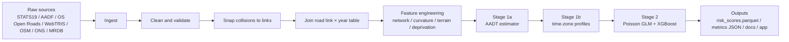
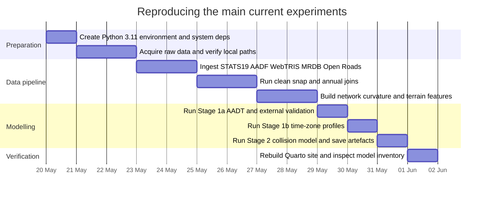
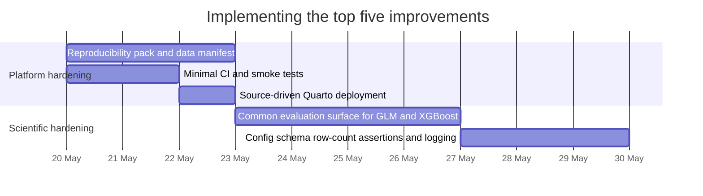

# Open Road Risk repository and site review

## Executive summary

Open Road Risk is a serious research-grade road-safety modelling platform that already has a stronger methodological core than many early-stage analytics repositories, but it is not yet packaged like a reproducible external-facing product. The public surface is clearly intended to be `openroadrisk.org`: the root README points readers there, `quarto/CNAME` binds the site to that domain, and `quarto/_quarto.yml` declares the site URL and full navigation structure. The repo’s current scope is explicit and ambitious: an open-data pipeline for exposure-adjusted collision risk across Northern and Central England, covering 2015–2024 and scoring 2,167,557 OS Open Roads links. fileciteturn8file0 fileciteturn58file0 fileciteturn41file0

The strongest parts are the architectural separation of stages, the candour about earlier mistakes, and the density of methodology documentation. The repository explicitly documents the earlier inflated `~0.86` figure as stale because of “feature-table leakage”, gives the current honest XGBoost baseline at about `0.3235` pseudo-R² out of sample, and explains why the GLM and XGBoost metrics are not directly comparable. That combination of self-correction, diagnostics, and public methodology pages is a major strength. fileciteturn8file0 fileciteturn24file0 fileciteturn27file0

The weakest parts are reproducibility, packaging, and platform hardening rather than modelling logic. The repo still relies on manual raw-data acquisition, manual system dependencies like `osmium-tool`, local artefacts for some “live status” documentation, a Pages workflow that deploys pre-rendered `_site` output rather than building Quarto from source, and a backlog that still calls for minimal CI, smoke tests, a `data/README.md`, config cleanup, and a PostGIS loader. In short: the analytical engine is ahead of the operational shell. fileciteturn8file0 fileciteturn22file0 fileciteturn32file0 fileciteturn43file0

If you want the highest-value next move, the order should be: build a reproducibility pack, add minimal CI and smoke tests, make docs deployment source-driven, standardise evaluation onto one common held-out surface, and then harden config and data-quality guardrails. Only after that should time go into productisation features like the app, database loader, or external benchmarking claims. That sequencing best matches the repo’s own evidence and backlog. fileciteturn32file0 fileciteturn50file0 fileciteturn51file0

## Source footing and public documentation

I started with the website surface as represented inside the repository, because the repo itself declares that the documentation site is `https://openroadrisk.org/`, `quarto/CNAME` contains `openroadrisk.org`, and `_quarto.yml` sets `site-url: "https://openroadrisk.org/"`. The Quarto site is not an afterthought: the site config exposes a broad public navigation across Project, Background, Literature, Data Sources, Methodology, Analysis, Models, Outputs, Tools, and Future Work. `quarto/project/project-overview.qmd` also states that the `.qmd` pages in `quarto/` are the “canonical public documentation”. fileciteturn8file0 fileciteturn58file0 fileciteturn41file0 fileciteturn23file0

That documentation surface is unusually rich for a personal research repository. The home page gives a clear public-facing explanation of the core idea — “raw collision counts are misleading without traffic context” — and the project overview page spells out what the system is, what it is not, its source families, its outputs, and its limitations. There is also explicit disclosure that AI tools were used under human direction and review, which is strong transparency practice rather than pure marketing gloss. fileciteturn42file0 fileciteturn23file0 fileciteturn29file0

The main documentation weakness is deployment mechanics. The Pages workflow uploads `quarto/_site` directly and only triggers on changes to `quarto/_site/**` or the workflow file itself, which means source changes in `.qmd` do not automatically rebuild the site unless the rendered artefacts are also committed. That is workable for a solo workflow, but it creates avoidable drift risk between source, rendered docs, and published site. fileciteturn22file0 fileciteturn41file0

```yaml
on:
  push:
    branches: [main]
    paths:
      - "quarto/_site/**"

      - name: Upload Pages artifact
        uses: actions/upload-pages-artifact@v3
        with:
          path: quarto/_site
```

The snippet above is the single clearest operational smell in the current public-docs stack: deployment is artefact-driven, not source-driven. fileciteturn22file0

## Architecture, modules, data, and models

The repo builds a layered pipeline from raw administrative and geospatial inputs to network-wide risk outputs. At a high level, it ingests STATS19, AADF, WebTRIS, OS Open Roads, OSM, ONS context layers, and MRDB; cleans and snaps collisions; assembles link-year features; computes network and geometry attributes; estimates AADT; learns time-zone profiles; and finally trains a Poisson GLM plus a Poisson XGBoost model to score every link. The README and methodology pages are consistent on that three-stage modelling story. fileciteturn8file0 fileciteturn23file0 fileciteturn26file0 fileciteturn27file0



The modelling choices are also well documented in code and site pages. Stage 1a uses `HistGradientBoostingRegressor` with `GroupKFold` grouped by `count_point_id`, year-de-meaned log targets, and explicit exclusion of WebTRIS features from inference-time AADT estimation; Stage 1b trains one gradient-boosting regressor per time-band fraction grouped by `site_id`; Stage 2 fits a Poisson GLM with a log exposure offset and an XGBoost Poisson model with `base_margin=log_offset`, grouped by `link_id` for the held-out split. These are sensible, technically literate choices for sparse count data and repeated link-year observations. fileciteturn34file0 fileciteturn35file0 fileciteturn39file0 fileciteturn36file0 fileciteturn37file0

```python
model = XGBRegressor(
    objective="count:poisson",
    n_estimators=500,
    max_depth=6,
    learning_rate=0.05,
    subsample=0.8,
    colsample_bytree=0.8,
    n_jobs=1,
)
```

This XGBoost configuration is simple, reproducibility-conscious, and understandable, though not yet obviously tuned against a fixed benchmark harness. fileciteturn37file0

The repo’s data contract is mostly parquet-and-JSON centric. Raw data are intentionally excluded from git, while processed tables and model outputs are described as parquet artefacts such as `aadt_estimates.parquet`, `timezone_profiles.parquet`, `risk_scores.parquet`, plus supporting JSON like `collision_metrics.json` and provenance files in `data/provenance/`. That is a good machine-friendly format choice, but the absence of a central data manifest means reproducibility still depends on tacit knowledge and scattered docs. fileciteturn8file0 fileciteturn24file0 fileciteturn46file0 fileciteturn52file0

### Key module comparison

*Approximate LOC bands are based on inspected file lengths and code-body depth surfaced by the connector; the connector does not expose exact total line counts directly.*

| Module area | Responsibility | Main file | Approx. LOC band | Evidence |
|---|---|---|---|---|
| Config and CLI | Load YAML config, resolve paths, expose stage CLI | `src/road_risk/config.py`, `src/road_risk/model/main.py` | Small, roughly `100–150` | Clear YAML loading and path helpers in `config.py`; stage CLI in `main.py` supports `traffic`, `profile`, `temporal`, `collision`, `all`. fileciteturn44file0 fileciteturn33file0 |
| AADT estimation | Stage 1a exposure estimation for every link-year | `src/road_risk/model/aadt.py` | Very large, roughly `800+` | HistGradientBoosting with GroupKFold, counted-only AADF filter, external validation schemes, network-feature snapping, full-network inference. fileciteturn34file0 fileciteturn35file0 |
| Time-zone profiles | Stage 1b within-day traffic shape estimation | `src/road_risk/model/timezone_profile.py` | Medium-large, roughly `400–600` | Learns fractions, groups by `site_id`, reconstructs hourly flows from estimated AADT. fileciteturn39file0 |
| Collision modelling | Stage 2 training, scoring, artefact persistence | `src/road_risk/model/collision.py` | Large, roughly `600+` | Full link-year table, Poisson GLM, XGBoost Poisson, chunked scoring, saved metrics and models. fileciteturn36file0 fileciteturn37file0 fileciteturn38file0 |
| Network and contextual features | Graph metrics, LSOA joins, RUC, effective speed limits, provenance | `src/road_risk/features/network.py` | Very large, likely `1000+` | Handles betweenness, distance to major road, population density, RUC, IMD, and speed-limit lookup logic. fileciteturn52file0 |
| Geometry features | Curvature and terrain-derived road geometry signals | `src/road_risk/features/road_curvature.py`, `src/road_risk/features/road_terrain.py` | Medium-large, roughly `400–800` each | Curvature uses turning-angle density and sinuosity; terrain samples OS Terrain 50 and computes grade features. fileciteturn53file0 fileciteturn54file0 |
| Snapping and annual joining | Collision-to-link matching and link-year assembly | `src/road_risk/clean_join/snap.py`, `src/road_risk/clean_join/join.py` | Large, roughly `500–900` each | Weighted multi-criteria snapping plus separate road-link annual aggregation logic. fileciteturn55file0 fileciteturn56file0 |
| Diagnostics and audit | Leakage, overlap, feature audit, rank checks | `src/road_risk/diagnostics/feature_audit.py` and related files | Medium-large, roughly `500+` | Dedicated audit code exists for missingness-vs-collision-history and join-sanity diagnostics. fileciteturn51file0 |
| Public documentation | Quarto site, model inventory, methods, future work | `quarto/_quarto.yml`, `quarto/*.qmd` | Large content layer | Public docs are wide-ranging, and the site is the canonical public documentation surface. fileciteturn41file0 fileciteturn23file0 |

## Dimension-by-dimension assessment

| Dimension | Concise findings | Evidence | Actionable recommendation |
|---|---|---|---|
| Purpose and scope | Scope is unusually explicit and appropriately bounded: open-data, exposure-adjusted road-risk modelling across Northern and Central England, with a clear warning that it is not a real-time or causal intervention system. The repo also records its evolution from a Yorkshire pilot to a broader study area, which is good historical candour. | `README.md`; `quarto/project/project-overview.qmd`; `quarto/index.qmd`. fileciteturn8file0 fileciteturn23file0 fileciteturn42file0 | Freeze the public scope statement into versioned release notes so future expansions do not silently shift the interpretation of published results. |
| README and documentation quality | Documentation is a clear strength. The README is specific, the Quarto site is broad, the project overview says `.qmd` pages are the canonical public docs, and the AI-assisted-development page improves governance transparency rather than hiding process. | `README.md`; `quarto/_quarto.yml`; `quarto/project/project-overview.qmd`; `quarto/project/ai-assisted-development.qmd`. fileciteturn8file0 fileciteturn41file0 fileciteturn23file0 fileciteturn29file0 | Keep the depth, but add a shorter stakeholder-facing “how to trust this” page that summarises metrics, caveats, provenance, and intended use. |
| Project structure and key modules | The package structure is coherent and stage-based, but some naming friction remains: repo name `open-road-risk`, package import `road_risk`, and project name `road_risk_analysis`. The CLI still exposes both `profile` and `temporal`, which reads like legacy overlap rather than a polished public contract. | `README.md` repo tree; `pyproject.toml`; `src/road_risk/model/main.py`; `src/road_risk/config.py`. fileciteturn8file0 fileciteturn9file0 fileciteturn33file0 fileciteturn44file0 | Align naming across repo, package, and project metadata, and formally deprecate ambiguous or legacy entrypoints. |
| Data files and formats | Data handling is modern and practical: parquet for large tables, JSON for provenance and metrics, and git exclusion for bulky raw and processed data. The weakness is discoverability: exact dataset versions, expected filenames, checksums, and licensing terms are not centralised in one data catalogue. | `README.md`; `config/settings.yaml`; `.gitignore`; `todo/infrastructure.md`; `src/road_risk/features/network.py`. fileciteturn8file0 fileciteturn10file0 fileciteturn46file0 fileciteturn32file0 fileciteturn52file0 | Add `data/README.md` plus `data/manifest.yaml` covering source URLs, licences, versions, checksums, expected local paths, and whether each source is optional or mandatory. |
| Model architectures and training code | The modelling design is thoughtful: Stage 1a uses grouped CV and year de-meaning; Stage 1b predicts fractions instead of absolute flows; Stage 2 uses log offsets correctly and explicitly forbids post-event diagnostic columns. The code also shows real methodological learning from prior leakage and inference mismatch. | `src/road_risk/model/aadt.py`; `src/road_risk/model/timezone_profile.py`; `src/road_risk/model/collision.py`; `quarto/methodology/feature-engineering.qmd`. fileciteturn34file0 fileciteturn39file0 fileciteturn36file0 fileciteturn37file0 fileciteturn26file0 fileciteturn27file0 | Keep this architecture, but add one durable, versioned “model contract” doc that pins feature lists, hyperparameters, train/test logic, and output schema for each release. |
| Evaluation metrics and results | The repo is admirably honest about metric caveats. The strongest current evidence is `AADT` CV R² around `0.83`, GLM pseudo-R² `0.3472` in-sample on the downsampled set, and XGBoost pseudo-R² `0.3235` mean out-of-sample over five seeds, with explicit warning that the GLM and XGB metrics are not directly comparable and the old `~0.86` narrative should not be used. | `README.md`; `quarto/methodology/model-inventory.qmd`; `quarto/methodology/feature-engineering.qmd`; `quarto/project/model-status.qmd`. fileciteturn8file0 fileciteturn24file0 fileciteturn27file0 fileciteturn43file0 | Highest-priority modelling task: compute GLM and XGBoost on the same held-out links against the same null model, then make that the canonical evaluation surface. |
| Dependencies and environment setup | `pyproject.toml` is modern, explicit, and complete enough to be useful, with Python `>=3.11`, runtime dependencies, and a `dev` extra. The repo still lacks a lockfile, Conda environment, Docker image, or provisioning script, and the README requires manual installation of `osmium-tool`. | `pyproject.toml`; `README.md`. fileciteturn9file0 fileciteturn8file0 | Add one pinned environment path: either `uv.lock`/`requirements-lock.txt` or `environment.yml`, plus a short bootstrap script for system packages. |
| Tests and CI | There is real test evidence, but coverage is selectively deep rather than broad: surfaced tests cover collision scoring, curvature, and terrain. CI coverage is the real hole; the only discovered workflow publishes the Quarto site, and the repo backlog itself still calls for minimal CI and smoke tests. | `pyproject.toml`; `tests/test_collision_scoring.py`; `tests/test_road_curvature.py`; `tests/test_road_terrain.py`; `.github/workflows/publish.yml`; `todo/infrastructure.md`. fileciteturn9file0 fileciteturn18file0 fileciteturn19file0 fileciteturn20file0 fileciteturn22file0 fileciteturn32file0 | Add GitHub Actions on push and PR to run `ruff check` and a synthetic-data `pytest` smoke subset. Do not wait for productisation. |
| Licensing and contribution guidelines | Code licensing is clear and permissive: MIT. By contrast, contribution process appears under-specified: I did not find a formal `CONTRIBUTING.md`, `CODEOWNERS`, or contributor workflow in inspected sources, and data licences are not yet summarised alongside code licensing. | `LICENSE`; `README.md`; `todo/infrastructure.md`. fileciteturn13file0 fileciteturn8file0 fileciteturn32file0 | Add `CONTRIBUTING.md` and a short data-licensing matrix distinguishing code licence from dataset terms and redistribution constraints. |
| Security and privacy | The basics are partly there: `.env`, `*.env`, and `config/secrets.yaml` are ignored, raw data are not committed, and the site config includes Google Analytics. What is missing is a visible security or privacy policy, plus explicit treatment of analytics/cookies and any governance note for handling coordinate-rich public safety data. | `.gitignore`; `quarto/_quarto.yml`; `docs/internal/data-quality-notes.md`. fileciteturn46file0 fileciteturn41file0 fileciteturn30file0 | Add `SECURITY.md`, a short website privacy note, and a dataset-governance page covering analytics, public-data handling, and redistribution boundaries. |
| Reproducibility and run instructions | The repo is runnable in principle: the README gives a sequenced quick start, the CLI works, and the methodology pages explain stage outputs. It is not yet clean-room reproducible because target platform, dataset versions, expected disk/RAM footprint, and one-command orchestration are still unspecified, and the backlog explicitly calls for `data/README.md`. | `README.md`; `src/road_risk/model/main.py`; `quarto/project/project-overview.qmd`; `todo/infrastructure.md`. fileciteturn8file0 fileciteturn33file0 fileciteturn23file0 fileciteturn32file0 | Create a reproducibility pack: data manifest, `make`/`just` targets, smoke fixtures, and a “minimum viable rerun” document with expected artefacts and durations. |
| Gaps, bugs, and technical debt | The good news is that the repo already documents and fixes serious past issues: police-force-code selection, snap-rate interpretation, feature leakage, and HGV missingness diagnostics. The remaining debt is classic but important: manual dual bboxes in config, lingering unused settings, mixed `print`/logger usage, Pages deployment from committed `_site`, `.github/` in `.gitignore`, missing smoke tests, and several backlog items around invariants and schema validation. | `README.md`; `docs/internal/data-quality-notes.md`; `docs/notes/diagnostics.md`; `src/road_risk/diagnostics/feature_audit.py`; `config/settings.yaml`; `.gitignore`; `.github/workflows/publish.yml`; `todo/infrastructure.md`. fileciteturn8file0 fileciteturn30file0 fileciteturn50file0 fileciteturn51file0 fileciteturn10file0 fileciteturn46file0 fileciteturn22file0 fileciteturn32file0 | Treat operational debt as first-class work: remove `.github/` from `.gitignore`, add row-count assertions and schema checks, unify logging, and stop relying on rendered artefacts as the docs source of truth. |
| Suggested improvements and prioritised next steps | The repo’s own backlog is directionally good and broadly aligns with what the code inspection suggests: minimal CI, a data README, config migration, smoke tests, force-area audit, logger integration, and product-facing exports. The biggest missing piece is prioritisation by dependency rather than desirability. | `todo/infrastructure.md`; `quarto/future-work.qmd`. fileciteturn32file0 fileciteturn61file0 | Prioritise work by prerequisite order: reproducibility, CI, docs build, common evaluation surface, config/invariant hardening, then app/export, then external benchmarking. |
| Potential collaborators and related projects | The repo itself points toward the right ecosystem. It explicitly queues a future “Related work / where this fits” page mentioning Lovelace / Leeds ITS active travel work and proprietary comparators, and it has a full design note for an external iRAP-class benchmark framed as convergent validity rather than replacement. Natural collaborator types are therefore DfT, National Highways, Ordnance Survey, local authority safety teams, Leeds/transport analytics groups, and iRAP/AusRAP/KiwiRAP benchmark holders. | `todo/infrastructure.md`; `todo/irap_benchmark.md`; `quarto/future-work.qmd`; `quarto/project/project-overview.qmd`. fileciteturn32file0 fileciteturn62file0 fileciteturn61file0 fileciteturn23file0 | Formalise collaborator asks as work packages: data validation, external benchmark design, corridor ground-truthing, release-alignment checks, and open-methods review. |

## Prioritised roadmap and task list

The roadmap below is deliberately dependency-led. It assumes the immediate goal is not “add more clever features” but “make the current platform trustworthy, rerunnable, and easy to extend without reintroducing leakage or silent drift”. That matches the repository’s own backlog and the strongest risks surfaced in the inspection. fileciteturn32file0 fileciteturn50file0 fileciteturn51file0

| Priority | Task | Owner or role | Estimated effort | Acceptance criteria |
|---|---|---|---|---|
| P0 | Build a reproducibility pack | Maintainer + data engineer | `2–3` days | `data/README.md` exists; every raw source has URL/licence/version/expected filename/checksum; `make repro-smoke` or equivalent documents the minimum rerun path from clean checkout to stage outputs. |
| P0 | Add minimal CI and smoke tests | Platform engineer + QA engineer | `1–2` days | GitHub Actions runs on push and PR; `ruff check` passes; synthetic-data `pytest` smoke subset passes; failures block merge by policy. |
| P0 | Convert docs deployment to build from source | Docs engineer | `0.5–1` day | A `.qmd`-only change triggers Quarto render in CI and publishes updated Pages output without manual `_site` commits. |
| P1 | Standardise evaluation onto a common held-out benchmark | ML engineer | `2–4` days | One saved evaluation spec computes GLM and XGBoost on the same held-out links, same null model, same metric definitions; README and site stop relying on mixed-surface comparisons. |
| P1 | Harden config and join invariants | Maintainer + QA engineer | `2–3` days | Single source of truth for bounding box; schema validation or equivalent fail-loud checks; row-count assertions at major joins; `.github/` removed from `.gitignore`; key run summaries logged, not printed. |
| P1 | Expand test coverage beyond geometry helpers | QA engineer + data engineer | `1–2` days | Fast synthetic tests added for ingest, clean, join, and model entrypoints, especially config/path failure cases and row-count invariants. |
| P2 | Add governance docs | Maintainer | `0.5–1` day | `CONTRIBUTING.md`, `SECURITY.md`, and website privacy/data-governance notes are published and linked from README/site. |
| P2 | Package outputs for downstream users | Data engineer + GIS engineer | `2–4` days | GeoPackage export, database loader, and output schema docs exist; downstream user can consume top-risk output without re-running modelling stages. |
| P2 | External benchmark design and pilot | Research engineer + collaborator liaison | `2–3` days for design, longer for execution | Quarto design doc for RAP-class benchmarking is published and reviewed; no public benchmarking claims are made before internal validation and stability work are complete. |
| P3 | Product-facing app hardening | Front-end or app engineer | `3–5` days | Streamlit app loads scored outputs predictably, exposes filters, and is backed by documented serving/query paths rather than local ad hoc files. |

The top five tasks are the ones that change the project’s risk profile fastest. Right now the biggest threat is not that the modelling is simplistic; it is that an otherwise strong analytical repo can still be hard to rerun, easy to drift, and awkward to contribute to. Fixing those five items would materially improve scientific trust, onboarding, and public credibility without changing the current model logic. fileciteturn22file0 fileciteturn32file0 fileciteturn43file0

The natural collaborator set is also already visible from the repo’s own dependencies and backlog, even though I found no evidence in connected sources of formal active partnerships. What follows should therefore be read as a suggested collaboration map, not a claim about existing collaborators. fileciteturn32file0 fileciteturn62file0

| Suggested collaborator or related-project lane | Why it fits | Evidence in repo or site | First concrete ask |
|---|---|---|---|
| National Highways / WebTRIS and SRN data teams | Stage 1b depends on WebTRIS and the site includes Network Model GDB material; they can validate temporal and SRN assumptions. | Core data-source role in README/project overview and future work. fileciteturn8file0 fileciteturn23file0 fileciteturn61file0 | Validate profile assumptions and benchmark which outputs matter most for SRN screening. |
| Ordnance Survey | Open Roads and Terrain 50 are foundational, and curvature docs explicitly warn that link identifiers are not persistent across releases. | `road_curvature.py`; `road_terrain.py`. fileciteturn53file0 fileciteturn54file0 | Review release-alignment strategy and stable join keys or migration guidance. |
| Department for Transport data and safety-methods teams | STATS19 and AADF are core inputs, and force-code / coverage decisions are a major methodological sensitivity. | README, settings, data-quality notes. fileciteturn8file0 fileciteturn10file0 fileciteturn30file0 | Validate force-area/bbox filtering logic and discuss stakeholder-relevant target definitions. |
| Local authority or combined-authority safety analysts | The system is positioned for corridor screening and local prioritisation, not real-time control. | Project overview and outputs intent. fileciteturn23file0 fileciteturn8file0 | Ground-truth top-risk corridors and define what outputs are decision-useful. |
| Academic transport-safety and geospatial methods groups | The backlog explicitly wants a “where this fits” page and the repo has a heavy literature layer. | `_quarto.yml`, literature/future-work pages, backlog mention of Lovelace / Leeds ITS. fileciteturn41file0 fileciteturn61file0 fileciteturn32file0 | Co-review evaluation design, facility-family split, and severity-specific extensions. |
| iRAP / AusRAP / KiwiRAP benchmark holders | The repo already contains a detailed benchmark design note and correctly frames RAP-class data as external validation, not a production feature. | `todo/irap_benchmark.md`. fileciteturn62file0 | Agree benchmark geography and section table design before any join or public claims. |

## Timelines

The first timeline shows the most realistic path to reproduce the main current experiments from a clean checkout once raw inputs are available. The second shows the top five improvements in the order that best reduces operational and scientific risk. The exact wall-clock runtime remains partly unspecified in connected sources because hardware, storage throughput, and exact dataset versions are not pinned in the repo. fileciteturn8file0 fileciteturn33file0 fileciteturn32file0





## Open questions and limitations

Several details remain unspecified in connected sources and should be treated as gaps rather than guessed facts. Python `>=3.11` is specified, but the target operating system, memory envelope, storage requirements, exact dataset versions, and checksums are not pinned in the inspected files. The repo clearly expects a fair amount of local context and project knowledge during setup. fileciteturn9file0 fileciteturn8file0

I found strong evidence for licence, methodology, tests, docs, and one deploy workflow, but I did not find a formal `CONTRIBUTING.md` or `SECURITY.md` during connected-source inspection. I also did not rely on any other GitHub repositories, per instruction, and the collaborator suggestions above are therefore recommendations inferred from the repo’s own data dependencies, backlog, and benchmarking notes rather than evidence of current formal relationships. Those absences do not weaken the modelling work, but they do matter for external trust and maintainability.

Finally, the module LOC figures above are intentionally approximate. The connector gave enough code access for architectural review, but not a clean exact-total line count for every file without disproportionate extra probing. That uncertainty does not change the main conclusion: Open Road Risk is already a technically literate and unusually transparent research platform, and the highest-return work now is operationalisation, reproducibility, and evaluation discipline rather than inventing a wholly new model family.