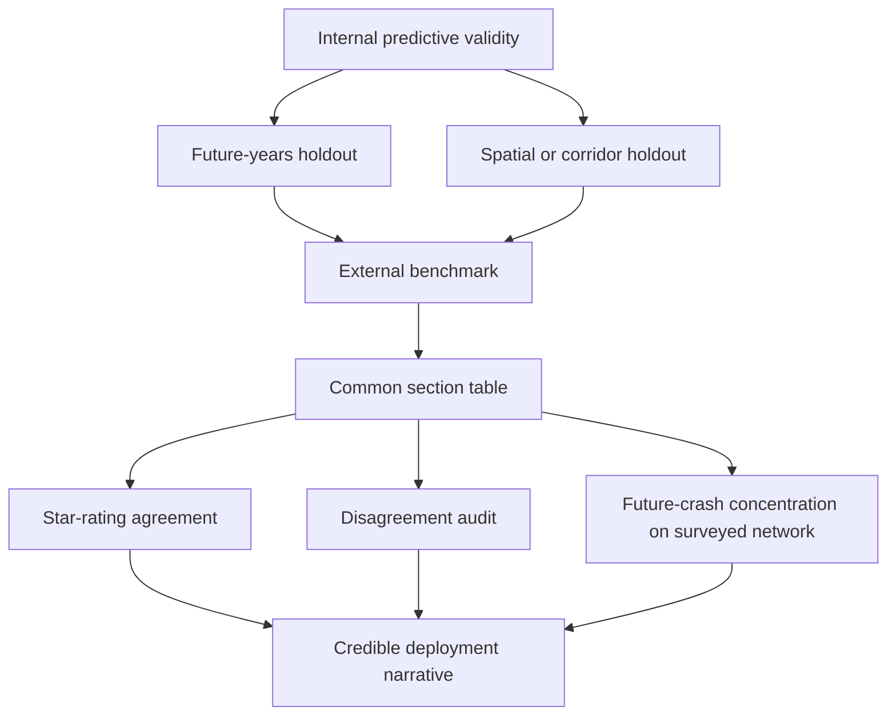
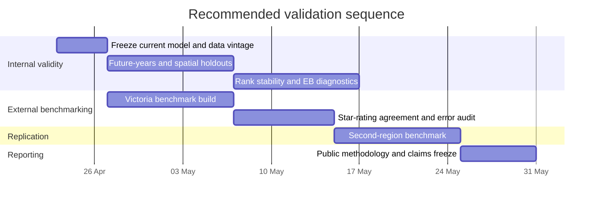

# Evaluating the model with iRAP-class benchmarks

## Executive summary

Your instinct is correct, but the highest-value use of iRAP is **not** to add a star rating column straight into the current production model. The more defensible move is to use iRAP-class data as an **external benchmark** for convergent validity. From the project material you supplied, the current pipeline is already substantial: an OS Open Roads link×year model over about 2.17 million links for 2015–2024, with Stage 1a counted-only AADT CV R² around 0.83 and Stage 2 XGBoost pseudo-R² of 0.858. That is a strong starting point, but it still leaves the main credibility gap that most transport stakeholders care about: **does the risk signal agree with an accepted infrastructure-safety standard outside your own training setup?** fileciteturn0file1 fileciteturn0file2

That benchmark needs to use the **right iRAP output**. Official iRAP documentation makes a sharp distinction between **Star Ratings**, which measure the safety “built in” to roads using more than 50 coded attributes, and **Risk Maps** or FSI estimates, which use crash history and flow calibration. For your model, Star Ratings are the cleaner label because they are infrastructure-oriented and more independent of your own crash-based target. Risk Maps and FSI estimates are still useful, but mainly as secondary sense-checks because they import historic crash and traffic information back into the evaluation. citeturn5view6turn16search3turn16search8

Among the official open ecosystems currently available, the strongest immediate proving ground is **entity["state","Victoria","Australia"] in entity["country","Australia","oceania"]**. The official Victorian portal publishes a public AusRAP dataset, a public crash dataset, and a public declared-road AADT dataset, all in machine-readable formats; the crash and AADT resources explicitly show Creative Commons Attribution 4.0 licensing on the pages reviewed. By contrast, the closest UK-like institutional analogue is **entity["country","New Zealand","oceania"]**, where the official crash and state-highway traffic ecosystems are open and strong, but the public KiwiRAP materials I found are much more report/map-centric than a clean downloadable benchmark layer. citeturn5view0turn5view1turn6view2turn7view0turn5view9turn11search0turn10search1turn16search0

So the practical answer is: **yes, evaluate on a location with iRAP coverage; no, do not oversell that as proof of full equivalence to iRAP**. The claim that will stand up is narrower and stronger: your open model shows **convergent validity** against an internationally recognised road-infrastructure rating on surveyed roads, and can then be used to screen roads that are not routinely surveyed. That is a credible bridge from “interesting open-source model” to “serious triage tool”. citeturn5view7turn13search1turn16search4

## Where the current model stands

From the documentation you supplied, the current architecture is already well beyond a toy prototype. It models collision risk at **OS Open Roads link×year** grain; Stage 1a imputes AADT from counted rows only; Stage 1b estimates temporal profiles; and Stage 2 uses a Poisson GLM plus XGBoost, with `risk_percentile` driven by XGBoost and grouped splits by link. The README also makes clear that the GLM and XGBoost pseudo-R² values are **not directly comparable**, because they are not computed on a common evaluation basis. That warning is important and should stay prominent in any external-facing validation write-up. fileciteturn0file1 fileciteturn0file2

A second point matters just as much: your own backlog already recognises that **5-seed rank stability**, **Empirical Bayes shrinkage**, and further corridor-level sense checks are still pending. That means the current model is strong enough to benchmark, but not yet in the best possible state to make hard stakeholder claims about the exact top-1% list. In other words, external benchmarking should be added **alongside** stronger internal validation, not instead of it. fileciteturn0file3

Your own evaluation notes are directionally right here. The most defensible internal tests remain: future-years holdout, a naïve `AADT × length` baseline, and direct checks of Stage 1a against later physical counts. iRAP does not replace those tests because it answers a different question. Those tests ask, “does the model predict realised harm better than simpler alternatives?” An iRAP benchmark asks, “does the model’s ranking line up with an accepted infrastructure-safety assessment?” Both are needed. fileciteturn0file0

| Dimension | Current state | Why it matters for iRAP benchmarking | Basis |
|---|---|---|---|
| Modelling grain | OS Open Roads link×year | External benchmark must be conflated onto a common section basis | Project docs fileciteturn0file1 fileciteturn0file2 |
| Exposure logic | Collision model uses an exposure offset built from AADT and link length | Direct star-for-score substitution would mix unlike targets | Project docs fileciteturn0file2 |
| Current headline metric | XGBoost pseudo-R² 0.858 | Good internal signal, but not external proof | Project docs fileciteturn0file1 fileciteturn0file2 |
| Known evaluation gaps | Rank stability and EB shrinkage still queued | Benchmark claims should be paired with stability evidence | Project backlog fileciteturn0file3 |

## Where iRAP helps and where it does not

Official iRAP sources describe Star Ratings as an objective measure of the level of safety “built in” to the road, based on more than 50 road attributes affecting vehicle occupants, motorcyclists, bicyclists and pedestrians. The Road Safety Foundation’s UK process description adds that these attributes are coded every 100 metres and then processed in ViDA, while FSI estimates are calibrated using historical crash data and flows. That means iRAP is fundamentally an **infrastructure audit framework**, not a direct crash-count model. citeturn5view6turn16search8turn5view7

That distinction leads to a hard recommendation. Using iRAP Star Ratings as a training feature in your main risk model is only weakly attractive. Coverage is patchy, especially if your strategic story is that the model extends credible screening beyond surveyed major roads onto minor roads. Worse, if you train with star ratings and then validate against star ratings, you partially collapse the distinction between model and benchmark. By contrast, using iRAP as a **held-out benchmark** gives you exactly what you need: an external, stakeholder-recognised reference point. citeturn13search1turn16search3

| Candidate use of iRAP data | Verdict | Why |
|---|---|---|
| Core feature in the main production model | Not recommended for v1 | Coverage mismatch, circularity risk, and a weaker open-data story |
| External benchmark for convergent validity | Strongly recommended | Best balance of methodological independence and stakeholder credibility |
| Weak label for a separate infrastructure-proxy model | Reasonable later extension | Useful if you eventually want an “open star-proxy” model, separate from crash-risk prediction |
| Procurement and policy narrative | Strongly recommended after validation | Lets you say the open model aligns with an accepted audit framework on surveyed roads |

The benchmark target should also be chosen carefully.

| Benchmark label | Independence from your current model | Recommended use | Sources |
|---|---|---|---|
| Vehicle Star Rating | High | Primary benchmark | citeturn5view6turn16search8turn2search18 |
| Decimal Star Rating | High | Primary benchmark when available, because it preserves more rank information | citeturn16search8turn1search10 |
| FSI estimates | Medium to low | Secondary only; they depend on crash calibration and flows | citeturn16search8turn5view7 |
| Crash Risk Maps | Low | Secondary or narrative visual check only; not the main independent benchmark | citeturn16search3turn16search5 |

A useful way to think about disagreement is that it is often **diagnostic**, not evidence of failure. Because star ratings are infrastructure-centred and your model is realised-harm-centred, perfect overlap is neither expected nor even desirable.

| Your model | Star rating benchmark | Interpretation |
|---|---|---|
| High predicted risk | Low star rating | High-confidence priority corridor; both systems agree |
| High predicted risk | High star rating | Likely operational, demand, behavioural, or local context problem rather than a clearly poor corridor design |
| Low predicted risk | Low star rating | Latent infrastructure weakness with lower realised harm under current exposure conditions |
| Low predicted risk | High star rating | Reassuring case; lower urgency |

That is why you should not optimise the main model to maximise agreement with star ratings at any cost. Doing so would risk degrading its actual collision-prediction value.

## What an evaluation design that will stand up looks like

The right design is a **validation ladder** rather than one single score.

The key is to keep each layer conceptually distinct. Internal predictive validity tells you whether the open model forecasts future harm better than simpler baselines. External benchmark validity tells you whether the model’s ranking agrees with a recognised infrastructure-safety programme. Decision validity tells you whether the roads raised by the model are the ones a practitioner would plausibly inspect or treat first. fileciteturn0file0 citeturn5view7turn16search3

For the external benchmark itself, the metrics should reflect the fact that star ratings are **ordinal** and your model output is a **continuous risk ranking**.

| Evaluation layer | Recommended metric | What it tells you |
|---|---|---|
| Rank agreement | Spearman’s rho or Kendall’s tau between `risk_percentile` and inverse star score | Whether the ranking is directionally aligned |
| Low-star discrimination | AUROC and PR-AUC for identifying 1–2 star sections | Whether the model surfaces poor infrastructure corridors |
| Ordinal agreement | Quadratic-weighted kappa after binning predicted risk into five bands | Whether broad severity bands line up |
| Calibration | Mean future crash rate by predicted decile within each star band | Whether star agreement translates into realised harm |
| Operational screening | Share of top-x% predicted-risk length falling on 1–2 star roads | Whether the model would prioritise visibly risky corridors |
| Error analysis | Quadrant review of disagreement cases | Whether mismatches are explainable or suspicious |

The matching workflow should be conservative. Do not compare an OS Open Roads link directly to a native iRAP segment unless they represent the same physical sectioning logic. Instead, create a **common benchmark section table**, ideally by linearly referencing both systems onto the benchmark provider’s section IDs or onto a short, fixed-length segmentation such as 100-metre sections. Then aggregate your link-year predictions length-weighted onto that shared basis. For a motor-vehicle collision model, use the **vehicle** star rating where the benchmark exposes separate road-user outputs. citeturn16search8turn2search18

This is especially feasible in Victoria because the public AusRAP CSV preview shows fields such as road name, section identifiers, latitude/longitude, speed limit, lane count, lane width, curvature, grade, AADT, total SRS, and both raw and smoothed vehicle star-rating outputs. That is unusually rich for an open external benchmark and means you can evaluate not only final ranking agreement, but also whether your inferred geometric-risk signal looks plausible against the audited corridor features themselves. citeturn5view1turn2search18

One additional safeguard is necessary now. iRAP’s methodology is not static: in April 2026, iRAP announced Version 3.10 updates including decimal stars, a zero-star band, and operating-speed functionality. So every benchmark result must record **programme name, publication date, and model version**, or the comparison becomes vulnerable to silent methodology drift. citeturn1search10turn1search20

## The best benchmark geographies

There are really two different decisions here: **the best immediate proof-of-concept** and **the closest UK-like analogue**. Those are not quite the same.

### Best immediate proof-of-concept

The strongest open-data route I found is Victoria. The official portal from the Victorian transport department provides a public AusRAP dataset, a validated crash dataset built from police and hospital sources, and a directional AADT GeoJSON series for 2001–2019 on the declared road network. The crash and AADT resource pages reviewed both show CC BY 4.0 licensing. In practice, that means you can run a serious benchmark without scraping PDFs or negotiating ad hoc access. citeturn5view0turn5view1turn5view2turn6view2turn5view3turn7view0

### Closest UK-like analogue

The closest institutional analogue is New Zealand. The official Waka Kotahi portal provides open CAS crash data and open state-highway traffic datasets, including annual average daily traffic represented as both count sites and estimated traffic between sites, as well as daily traffic counts. However, the public KiwiRAP materials I found are mainly risk-map and star-rating reports and downloads, rather than a clearly current machine-readable open feature service equivalent to Victoria’s AusRAP CSV. That makes New Zealand attractive as a policy analogue, but less frictionless as a first benchmark dataset. citeturn5view9turn11search0turn10search0turn10search1turn16search0turn16search5

### Candidate comparison

| Candidate | Officially open benchmark material found | Crash and traffic backbone | Strengths | Main drawback | Best use | Sources |
|---|---|---|---|---|---|---|
| entity["country","United Kingdom","Europe"] | UK RAP/RSF public maps and reports for motorways and A-roads | Strong UK crash/traffic ecosystem already in your pipeline | Highest stakeholder resonance | From the official pages reviewed, I did not find an openly downloadable machine-readable star-rating dataset analogous to Victoria’s CSV release | Later-stage collaborative or council-specific validation | citeturn13search1turn13search2turn16search4 |
| entity["state","Victoria","Australia"] | Public AusRAP dataset with 63 non-sensitive public attributes and public portal metadata | Public crash data plus declared-road AADT GeoJSON series | Fastest, cleanest, machine-readable benchmark | AADT series shown is historical and no longer updated after 2019 on the reviewed page | First external proof-of-concept | citeturn5view0turn5view1turn5view2turn6view2turn7view0 |
| entity["state","New South Wales","Australia"] | Official AusRAP listed in map, CSV, GeoJSON and related downloadable formats on Data.NSW | Separate state-level crash/traffic integration still needed | Good second Australian benchmark and proof of transfer within one country | More wiring effort than Victoria from the sources reviewed | Second benchmark region after Victoria | citeturn14search0turn14search9turn16search4 |
| entity["country","New Zealand","oceania"] | Public KiwiRAP downloads and reports | Open CAS crash data and open state-highway traffic monitoring data | Closest policy and road-safety-programme analogue to the UK | Public benchmark appears less machine-ready than Victorian AusRAP | Best “closest analogue” case study; not the easiest first pilot | citeturn11search0turn5view9turn10search0turn10search1turn16search0turn16search1turn16search5 |

On the socio-economic side, the UK, Australia and New Zealand are all high-income countries by World Bank data, with 2024 GDP per capita of roughly US$53.2k for the UK, US$64.6k for Australia and US$49.2k for New Zealand. That does **not** prove transferability, but it does make Australia and New Zealand materially more plausible benchmark contexts for your narrative than lower-income or structurally dissimilar systems. As an inference, that supports your pivot away from a first proof using a more different European context. citeturn19search9turn19search10turn20search0

So the clean answer is this: **Victoria is the best first benchmark; New Zealand is the best second benchmark if your goal is “closest to the UK” rather than “lowest-friction public data”**.

## How this fits into the wider ecosystem

In the wider road-safety ecosystem, your model does **not** sit in the same slot as a classical survey-led road assessment programme. iRAP-class systems, and in the UK the work led by the **entity["organization","Road Safety Foundation","UK charity"]**, are designed to inspect and rate the safety that is built into a road’s design and operation. Their natural outputs are star ratings, investment plans, and infrastructure performance tracking. Your current model, by contrast, is an open-data predictive screening layer built from realised collisions, estimated exposure and open network features. Those are complementary roles, not duplicates. citeturn13search1turn13search2turn5view6turn5view7

That complementary positioning is stronger, not weaker. The Road Safety Foundation’s public description of UK RAP focuses on motorways and A-roads, while your project’s own framing is explicitly about extending exposure-adjusted risk scoring across the full network, including the large share of links without direct traffic counts. A credible open model therefore fills a real gap: it can act as the **network-wide triage layer**, while survey-led programmes remain the higher-cost, higher-specificity infrastructure-audit layer for priority corridors. citeturn13search1turn13search2 fileciteturn0file2

A useful ecosystem framing is:

| Ecosystem layer | What it does | Where your model fits |
|---|---|---|
| Survey-led infrastructure rating | Audits built-in safety and treatment needs | External benchmark and complementary audit layer |
| Official crash and traffic systems | Observe realised harm and exposure | Core training and recalibration backbone |
| Open predictive screening | Estimates risk on unsurveyed or under-measured links | This is your primary role |
| GIS and app delivery | Distributes outputs to analysts and authorities | Downstream delivery, not the core scientific claim |

The strongest stakeholder story therefore is not “we replace iRAP”. It is: **we provide an open, scalable screening layer whose priorities can be shown to align with recognised star-rating programmes on surveyed roads, and which can then be used to extend screening to roads that are not routinely assessed**. That is a much safer claim scientifically and a much easier claim to defend contractually and reputationally. citeturn5view7turn16search4

## Recommended validation plan

The most defensible plan is a two-track programme: strengthen internal validity and add one external benchmark before making bigger claims.

A practical sequence would be:

1. **Freeze the current model version and data vintage.** Do not let benchmark work happen while the production model is still drifting. Keep the existing pipeline as the baseline you are validating. fileciteturn0file1 fileciteturn0file2

2. **Complete the internal tests your own documentation already points to.** That means future-years holdout, a naïve exposure baseline, and the queued rank-stability work. If those results wobble badly, an iRAP benchmark will not rescue the story. fileciteturn0file0 fileciteturn0file3

3. **Build the first external benchmark in Victoria.** Use the public AusRAP dataset as the primary benchmark layer, the crash dataset as an observed-outcomes cross-check, and the declared-road AADT dataset where you need local exposure grounding. Because all three are official and machine-readable, this is the least brittle path. citeturn5view1turn6view2turn7view0

4. **Benchmark against vehicle Star Rating first, not risk maps.** That keeps the evaluation closest to an independent infrastructure label and avoids contaminating the benchmark with past crash history. Risk maps can be shown later in an appendix as a face-validity visual. citeturn5view6turn16search3turn16search5

5. **Report four things, not one.** Report rank correlation, low-star detection, calibration by star band, and disagreement diagnostics. A single headline correlation will be too easy to dismiss. Use corridor maps to show representative true positives and intelligent disagreements. citeturn5view7turn16search8

6. **Replicate once, then tighten the claim.** The next replication should be either New South Wales for “within-country transfer” or New Zealand for “closest UK analogue”. One Victorian result is already valuable; two independent public benchmarks are what turn it into a serious validation narrative. citeturn14search0turn16search4turn11search0

7. **Be precise in the public claim.** Say that the open model aligns with an internationally recognised road-infrastructure rating on surveyed roads and extends screening to unsurveyed roads. Do not say that it “replaces iRAP” or that one external validation proves full transferability to every UK minor road. citeturn5view7turn13search1turn1search10

## Bottom line

Yes, adding an iRAP-class benchmark would materially improve the credibility of the model. The best way to do it is **not** as a direct feature in the main model, but as a **separate external validation layer** that tests whether your open-data risk ranking converges with a recognised infrastructure-safety assessment. The best first proving ground is Victoria because the official data ecosystem is unusually complete and machine-readable. The best “closest to the UK” analogue is New Zealand, but it is a weaker first choice because the public KiwiRAP material appears much less convenient for direct benchmarking from the official sources reviewed. citeturn5view1turn6view2turn7view0turn11search0turn16search0

If you execute the benchmark this way, the model fits the wider ecosystem cleanly: survey-led programmes remain the accepted audit standard on surveyed corridors, while your open model becomes the scalable triage layer that fills in what those programmes and direct counts do not routinely cover. That is the strongest strategic position available to you. citeturn13search1turn5view7turn16search4