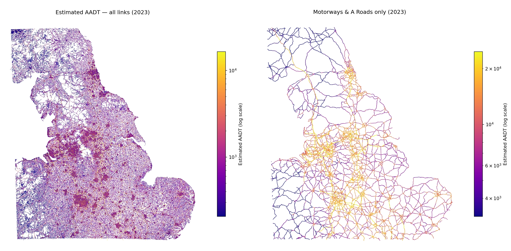
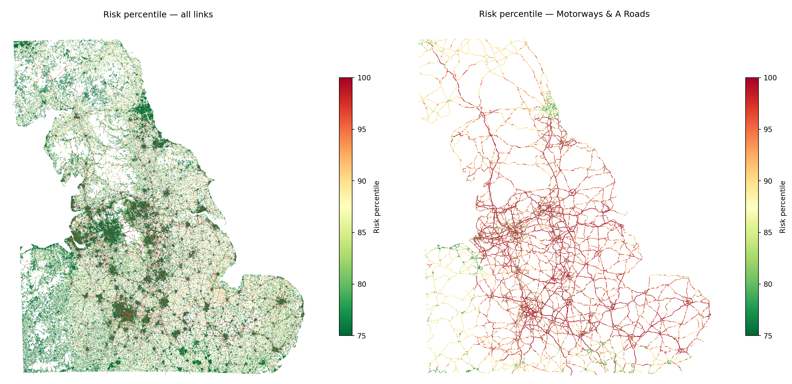
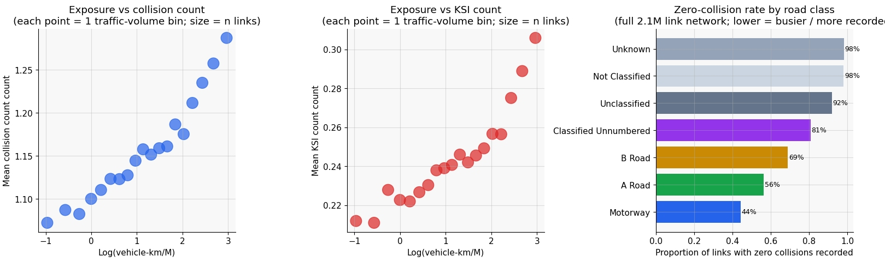

### Traffic

### Collision risk

## What this project is

Open Road Risk is an open-source pipeline for estimating an
[exposure-adjusted collision risk model](methodology/modelling.qmd) across the
road network.

The core idea is simple:

> raw collision counts are misleading without traffic context.

A road with ten reported collisions may be unusually dangerous if it carries very little traffic, or relatively safe if it carries very high traffic volumes. To compare roads fairly, collisions need to be interpreted relative to **exposure**.

This project combines open road network, traffic, and collision datasets to estimate risk at road-link level and support network screening, corridor comparison, and safety analysis.

## Why this matters

Most roads do not have direct traffic measurements.

Official traffic counts are concentrated on major roads and sampled count points, while collision records exist across the network. That creates a common problem in road safety analysis:

- collisions are observed widely
- exposure is only partially observed
- direct comparison is therefore difficult

This pipeline addresses that by estimating traffic where it is not measured and then modelling collision risk in relation to that estimated exposure.

## Site guide

The site is organised around the logic of the pipeline:

- **[Project Overview](project/project-overview.qmd)** — overview of repository layout, modelling stages, and current status
- **[Background](background/metrics-and-methodology.qmd)** — metrics, benchmarks, and methodology for road crash modelling
- **[Data Sources](data-sources/index.qmd)** — what each dataset contains and what it can and cannot tell us
- **[Methodology](methodology/methodology-index.qmd)** — how sources are joined and transformed into modelling inputs
- **[Analysis](analysis/eda-collisions.qmd)** — model behaviour, outputs, and exploratory evaluation
- **[Future Work](future-work.qmd)** — research questions and extensions the pipeline can support

A good place to start is with the source pages for
[STATS19 collision data](data-sources/stats19.qmd),
[AADF traffic counts](data-sources/aadf.qmd), and
[WebTRIS sensor data](data-sources/webtris.qmd), then move to the methodology
pages on [joining road safety datasets](methodology/data-joining.qmd) and
[feature engineering](methodology/feature-engineering.qmd).

For possible extensions, [Future Work](future-work.qmd) collects research
questions that are not in the active backlog but are natural next uses of the
same road-link, exposure, and collision-risk infrastructure.
