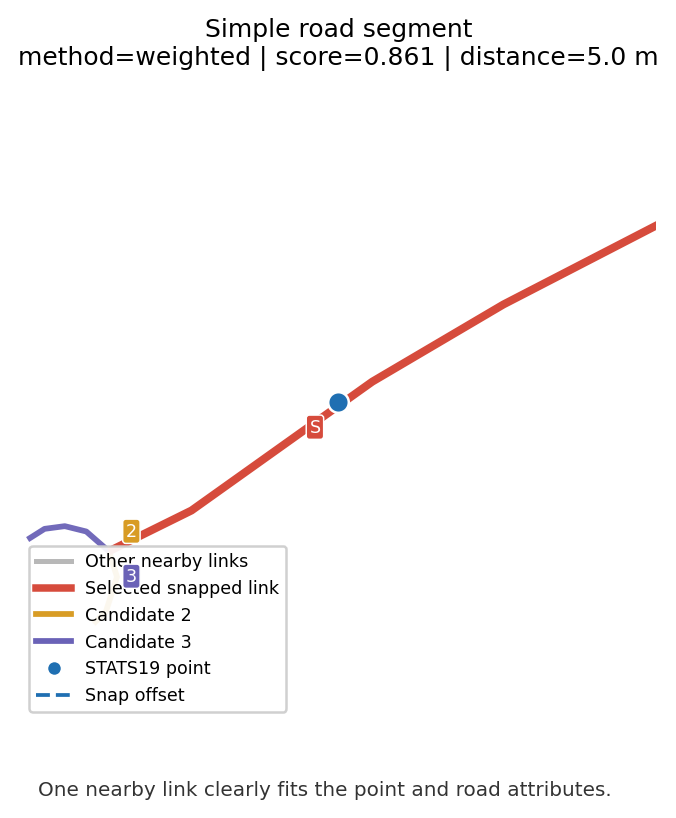
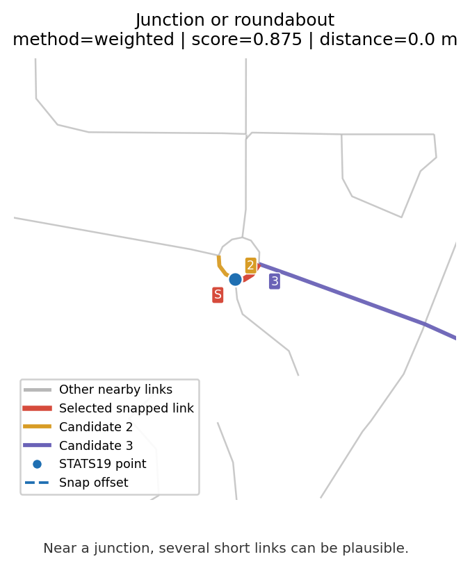
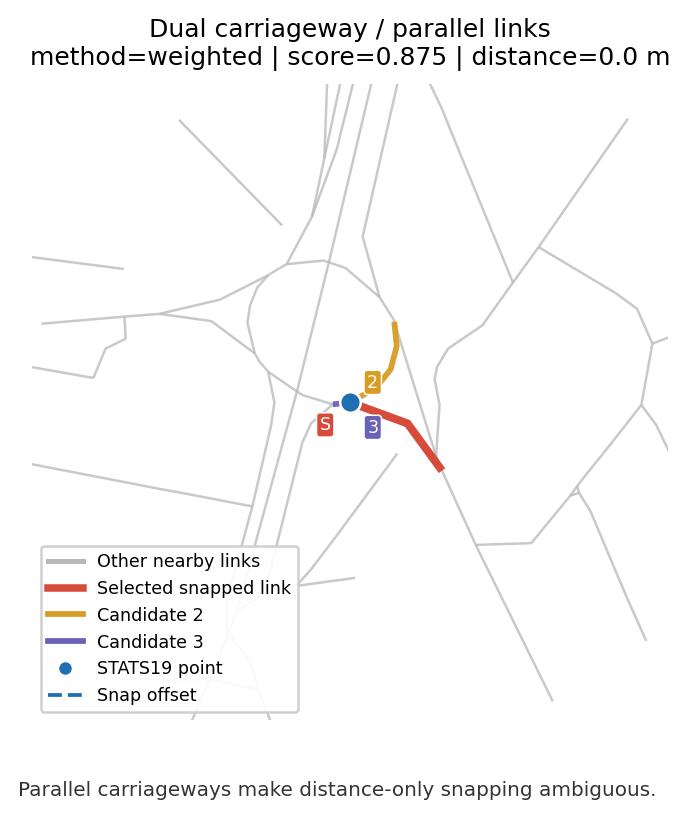
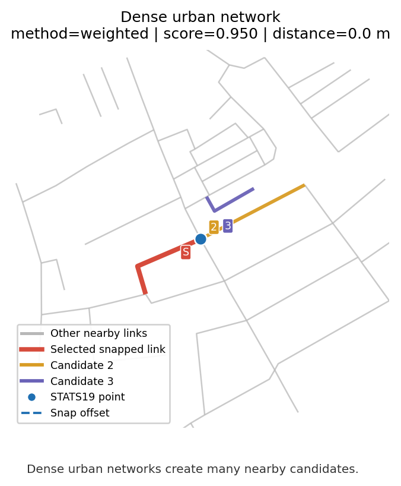
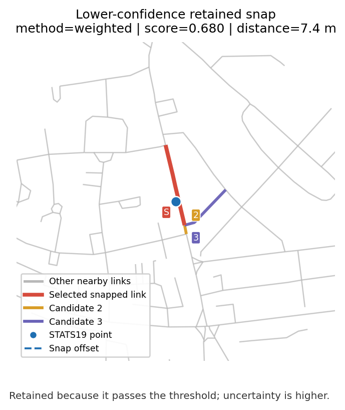
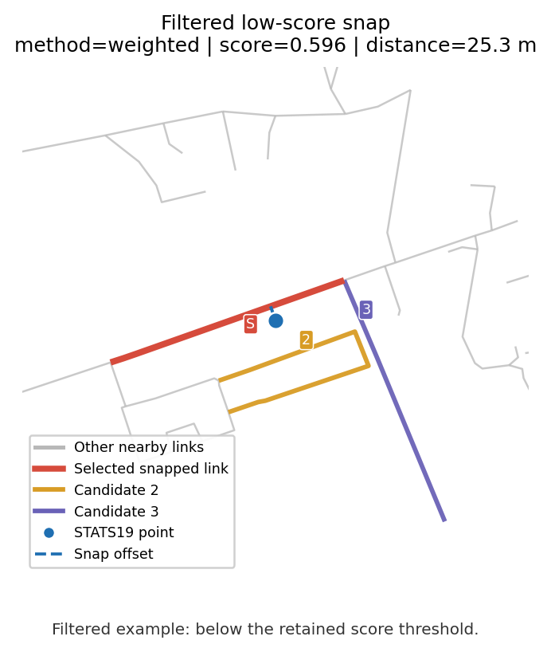

## Why joining is the hard part

The model target — collision rate per road link per year — does not exist in
any single dataset. It has to be constructed by joining three sources that were
never designed to be combined:

- **STATS19 collisions** are points with GPS coordinates and a police-recorded
  road name.
- **AADF traffic counts** are points at DfT count-point locations, keyed by
  `count_point_id`.
- **WebTRIS sensors** are points on the National Highways network, keyed by
  `site_id`.
- **OS Open Roads links** are line geometries with a `link_id` and a
  `road_classification`.

No shared key links them. Every connection has to be inferred from spatial
proximity, road names, or both.

::: {.callout-important}
**The joining stage is where most of the signal is gained or lost.** A collision
snapped to the wrong road changes both its traffic denominator and the road
attributes it inherits. Under-reporting aside, snap quality is the dominant
source of noise in the final rates.
:::

## What this page answers

1. What is being joined, and in what order?
2. How are collisions matched to road links, given that two collisions 10m
   apart might belong to an A-road and a parallel B-road?
3. How are traffic counts attached to road links when AADF count points are
   sparse and WebTRIS sensors are even sparser?
4. What happens to data beyond the distance caps, and why not just pick the
   nearest match?
5. How is match confidence tracked and used?

---

## Pipeline overview

The joining pipeline runs in five stages, implemented across `clean.py`,
`snap.py`, and `join.py`:

| Stage | Input | Output | Join method |
|---|---|---|---|
| 1. Clean STATS19 | Raw collision CSVs | Validated collisions with `road_name_clean` | LSOA coordinate check |
| 2. Snap collisions to links | Collisions + OS Open Roads | Collisions with `link_id` + `snap_score` | Weighted multi-criteria |
| 3. Attach WebTRIS to AADF | AADF + WebTRIS | AADF with sensor features | Spatial nearest (5 km cap) |
| 4. Attach AADF to road links | Road links + (AADF + WebTRIS) | Road features per link × year | Spatial nearest (2 km cap) |
| 5. Aggregate to link × year | Snapped collisions + road features | `road_link_annual.parquet` | Key join on `link_id × year` |

Each stage preserves confidence information — snap scores, distances, join
methods, availability flags — so the feature engineering can filter on quality.

---

## Stage 1: STATS19 cleaning

Collision cleaning happens in `clean_stats19()` and does three things that
matter for the joins downstream.

### Coordinate validation

Police-recorded lat/lon is generally reliable across Yorkshire forces, but a
small number of records have systematic errors. The pipeline validates each
collision's coordinates against its **recorded LSOA centroid** using haversine
distance:

- Collisions more than 10 km from their LSOA centroid are flagged as
  `coords_suspect = True`.
- Records outside the GB bounding box are flagged as `coords_valid = False`.

Flagged records are **not dropped** — they remain available for non-spatial
analysis — but they are excluded from the spatial snap.

::: {.callout-note}
Spatial snapping uses STATS19 `latitude` / `longitude`, not
`location_easting_osgr` / `location_northing_osgr`. A previous notebook
suspected a Yorkshire BNG grid-square error, but a direct check against the
current raw DfT STATS19 CSV found no systematic mismatch: Yorkshire BNG fields
agree with lat/lon-derived BNG positions within a few metres.
:::

### Road name reconstruction

STATS19 encodes road classification and number separately:
`first_road_class` (integer code) and `first_road_number`. These are
reconstructed into a single string:

```
class=1, number=62    → "M62"
class=3, number=64    → "A64"
class=4, number=1234  → "B1234"
class=6               → ""   (unclassified, no named road)
```

The result is stored as `road_name_clean` and feeds one of the four scoring
dimensions in Stage 2.

### COVID flag

`is_covid = True` for collisions in 2020 or 2021. Carried through all
downstream tables so the modelling code can optionally exclude or separately
model these years.

---

## Stage 2: Snapping collisions to road links

This is the hardest join in the pipeline. A collision on a named road must be
attached to the correct road link — and GPS noise, carriageway separation, and
parallel minor roads all make this non-trivial.

### Why nearest-neighbour fails

A naive nearest-neighbour snap fails in several common cases:

- **Parallel roads.** A collision on the M1 might be geometrically closer to
  a B-road running alongside than to the motorway itself.
- **Dual carriageways.** The two carriageways are separate OS Open Roads links;
  a collision reported on one side may snap to the other.
- **GPS drift.** Police-recorded coordinates can drift 20–50 m from the
  carriageway, especially on urban roads with tall buildings.
- **Long links with centroid-based indexing.** A 2 km motorway link has a
  centroid that could be 800 m from a collision 20 m off the road.

Snap.py addresses all four with two co-designed pieces: **link densification**
for the spatial index, and **multi-criteria scoring** for disambiguation.

### Densification: 25 m interpolation along each link

Before any matching, every OS Open Roads link is sampled at 25 m intervals
along its LineString geometry. A 2 km motorway link becomes ~80 points; a
20 m urban link becomes 2 points. All densified points carry their parent
`link_id`.

The KD-tree is built on these densified points, not on link centroids. This
means a collision 20 m from the road will always find a candidate point
within 25 m — regardless of link length.

### Candidate selection

For each collision, the KD-tree returns the **K = 20 nearest densified points**
within a **500 m search radius**. Points are deduplicated to their parent
links; the closest point per link is retained as that link's candidate
distance. The result is a set of up to 20 candidate links per collision.

### Scoring: four dimensions

Each candidate link is scored on four dimensions. The composite score is a
weighted sum with weights fixed at

| Dimension | Weight | What it measures |
|---|---|---|
| Spatial | 40% | Distance from collision to link, exponential decay |
| Road classification | 25% | STATS19 `first_road_class` vs OS `road_classification` |
| Junction / form of way | 25% | STATS19 `junction_detail` vs OS `form_of_way` |
| Road number | 10% | STATS19 reconstructed road name vs OS `road_name_clean` |

#### Spatial score

$$
s_\text{spatial}(d) = \exp\!\left(-\frac{d \log 2}{100}\right)
$$

Exponential decay with a 100 m half-life. Concretely: 100 m → 0.50, 200 m →
0.25, 500 m → 0.03. Spatial score alone is not enough — a collision 30 m off
an M-road will have a high spatial score against both the M-road link and
an adjacent A-road link.

#### Road classification score

Each STATS19 road class (1 = Motorway, 2 = A(M), 3 = A, 4 = B, 5 = C, 6 =
unclassified) has preferred / partial / penalty sets of OS classifications.
Example for class 1 (Motorway):

- **preferred (1.0):** `Motorway`
- **partial (0.5):** `A Road`
- **penalty (0.0):** `B Road`, `Unclassified`, etc.

Candidates not in any of the three sets score 0.5 (neutral).

#### Junction / form-of-way score

Uses `junction_detail` to constrain `form_of_way`. Key cases:

- `junction_detail = 0` (not at a junction) **penalises** Slip Road and
  Roundabout candidates.
- `junction_detail = 18` (private drive) **penalises** Motorway and Slip Road.
- `junction_detail = 99` or `-1` (unknown) applies no constraint.

#### Road number score

Exact string match on `road_name_clean`. Low weight (10%) because the STATS19
road number field has well-known quality issues — it's often missing or
mis-entered. Treated as:

- **1.0** — exact match (e.g. STATS19 "M62" ↔ OS "M62")
- **0.5** — STATS19 has no road number, or OS link has no road name (can't
  contradict)
- **0.1** — mismatch

### Output

The top-scoring candidate is returned per collision. The output carries
every per-dimension score as well as the composite:

- `link_id`, `snap_distance_m`, `snap_score`
- `score_spatial`, `score_class`, `score_junction`, `score_number`
- `snap_method ∈ {weighted, invalid_coords, unmatched}`

### The 0.6 threshold

In `join.py`, only collisions with `snap_score >= 0.6` are retained in the
link-year aggregation. The threshold is empirical — chosen so the retained
count matches a baseline from earlier pipeline versions.

The practical meaning of 0.6 depends on how the score components combine.
With neutral (0.5) scores on class, junction, and number, a composite of 0.6
requires spatial ≈ 0.75 — about **42 m** by the exponential decay. With
strongly-matching attributes, spatial can be much lower and still pass.

::: {.callout-note}
The 0.6 threshold trades off recall against precision. Lowering it recovers
more collisions (including correctly-matched ones at longer distances) but
introduces more errors on dense multi-road areas. It has not been formally
optimised against a gold-standard labelled set.
:::

### Worked graphical examples

The examples below show the spatial decision being made. The highlighted
alternatives are nearby candidate links reconstructed for explanation; the
exact internal candidate list is not stored in the final snapped output. The
aim is to show why snapping quality matters before collisions are aggregated
to road-link × year.

STATS19 collisions are point records, while the model needs counts on
`link_id × year`. Snapping assigns each point to a plausible OS Open Roads
link, then the retained snapped collisions are aggregated by `link_id × year`
before joining to AADT, road geometry, and context features. Near junctions,
dual carriageways, and dense urban networks, this is necessarily a spatial
approximation rather than a literal observation of the carriageway used.
Low-confidence, invalid, or unmatched records are filtered or handled
separately before rate modelling.

The figures are generated statically by
`src/road_risk/outputs/build_snap_example_figures.py` from existing processed
outputs. Grey lines are nearby OS Open Roads candidates, red is the selected
snapped link, and the blue point is the original STATS19 collision location.
Orange and purple links mark the next two reconstructed nearby candidates
shown for context. The labels `S`, `2`, and `3` identify the selected link and
the two highlighted alternatives; the dashed blue line shows the snap offset.
The compact scoring tables below are reconstructed explanatory candidate
tables: they reuse the weighted snap scoring functions, but the final snapped
parquet stores exact component scores only for the selected link, not for every
losing candidate.

Small schematic of the weighted snap:

`STATS19 point` → `find nearby densified Open Roads candidates` →
`score candidates` → `keep highest scoring link` → `apply 0.6 threshold` →
`aggregate retained collisions to link_id × year`

The first table is source-row context from the cleaned STATS19 collision
parquet. These fields are not the snap output: they are the original collision
row values carried through cleaning, shown here for the six example rows chosen
by the figure script.

| Example type | Original STATS19 row context |
|---|---|
| Simple road segment | `collision_index=2022501162401`; 2022-04-04 07:59; severity Slight; 2 vehicles, 1 casualty; first road A38; single carriageway; 50 mph; not at junction or within 20 metres; raining, no high winds; wet or damp; point (-4.349419, 50.407907). |
| Junction or roundabout | `collision_index=20171341K0936`; 2017-01-20 12:00; severity Slight; 2 vehicles, 1 casualty; first road A650; roundabout; 60 mph; STATS19 `junction_detail=0` (not at junction or within 20 metres); fine, no high winds; dry; point (-1.520043, 53.708393). |
| Dual carriageway / parallel links | `collision_index=2018200265540`; 2018-01-23 14:35; severity Slight; 2 vehicles, 3 casualties; first road A4540; road type roundabout; 40 mph; second road A38; raining, no high winds; wet or damp; point (-1.888107, 52.491773). |
| Dense urban network | `collision_index=2019051912399`; 2019-09-19 18:00; severity Slight; 2 vehicles, 1 casualty; first road unclassified; single carriageway; 30 mph; STATS19 `junction_detail=13` in the cleaned row; fine, no high winds; dry; point (-3.038868, 53.430502). |
| Lower-confidence retained snap | `collision_index=2023010445298`; 2023-05-26 19:03; severity Slight; 1 vehicle, 1 casualty; first road class C with no road number; single carriageway; 20 mph; not at junction or within 20 metres; fine, no high winds; dry; point (-0.249922, 51.516427). |
| Filtered low-score snap | `collision_index=2015950000240`; 2015-01-22 08:05; severity Serious; 2 vehicles, 1 casualty; first road B1345; single carriageway; 60 mph; not at junction or within 20 metres; fine, no high winds; wet or damp; point (-2.746766, 56.055312). |

The next table is snap-output traceability from
`quarto/outputs/figures/snap-examples-manifest.json`. It shows what the snap
step produced for those same STATS19 rows, including the selected OS Open Roads
`link_id` and whether the row is retained for link-year aggregation.

| Example type | STATS19 collision_index | Year | Snap method | Score | Distance | Selected link id | Candidates shown | Status | What this shows |
|---|---|---:|---|---:|---:|---|---:|---|---|
| Simple road segment | `2022501162401` | 2022 | weighted | 0.861 | 5.0 m | `65BCF56A-4692-46C5-AF86-284DA73DF77E` | 3 | retained | One nearby link clearly fits the point and road attributes. |
| Junction or roundabout | `20171341K0936` | 2017 | weighted | 0.875 | 0.0 m | `E43FE188-A37C-4085-BC80-8F3009AD643C` | 17 | retained | Near a junction, several short links can be plausible. |
| Dual carriageway / parallel links | `2018200265540` | 2018 | weighted | 0.875 | 0.0 m | `7DF69055-C6EC-459B-AD10-3C683FFCD19E` | 59 | retained | Parallel carriageways make distance-only snapping ambiguous. |
| Dense urban network | `2019051912399` | 2019 | weighted | 0.950 | 0.0 m | `0370946C-80EB-4F17-A5B4-3D8A25075146` | 71 | retained | Dense urban networks create many nearby candidates. |
| Lower-confidence retained snap | `2023010445298` | 2023 | weighted | 0.680 | 7.4 m | `F5232992-2B80-43BB-ACED-ECA1538996AB` | 135 | retained | Retained because it passes the threshold; uncertainty is higher. |
| Filtered low-score snap | `2015950000240` | 2015 | weighted | 0.596 | 25.3 m | `E2DE2F6D-9788-4273-9848-86AA8B014DAD` | 40 | filtered | Filtered example: below the retained score threshold. |

{fig-alt="Simple STATS19 snapping example showing nearby grey road links, a red selected road link, and a blue collision point."}

**Original STATS19 row:** `collision_index=2022501162401`; 2022-04-04 07:59; severity Slight; first road A38; single carriageway; 50 mph; not at junction; raining; wet surface; point (-4.349419, 50.407907).

**What this shows:** The ambiguity is limited here: the collision point sits close to one plausible
single-carriageway link, and the next nearby candidates are much farther away.
The snap chooses the red A-road link, which is plausible because both distance
and road class support it. Confidence is high, although it is still a spatial
linkage rather than ground truth. This collision is retained and later counted
under its selected `link_id × year`.

**Worked scoring breakdown (reconstructed):** The selected link is not chosen
by distance alone. Each nearby candidate is scored on distance, road class,
junction/form-of-way agreement, and road-number agreement; the highest
composite score is selected. These reconstructed composites use line-to-point
distances in the figure window, so the selected-row composite can differ
slightly from the saved snap score in the traceability table.

| Candidate | Role | Distance | Spatial | Class | Junction | Number | Composite | Why it matters |
|---|---|---:|---:|---:|---:|---:|---:|---|
| Rank 1 | Selected link | 1.5 m | 0.990 | 1.000 | 0.500 | 1.000 | 0.871 | Closest plausible A38 link. |
| Rank 2 | Alternative 2 | 146.2 m | 0.363 | 1.000 | 0.500 | 1.000 | 0.620 | Same road evidence, but much weaker spatial support. |
| Rank 3 | Alternative 3 | 146.2 m | 0.363 | 1.000 | 0.500 | 1.000 | 0.620 | Similar to candidate 2, so distance separates it from the selected link. |

Here, candidates 2 and 3 match the road number and class, but their spatial
score is much lower. The selected link wins because it is both the right road
class/number and much closer to the collision point.

{fig-alt="Roundabout STATS19 snapping example with nearby candidate road links, a selected red roundabout link, and a blue collision point."}

**Original STATS19 row:** `collision_index=20171341K0936`; 2017-01-20 12:00; severity Slight; first road A650; road type roundabout; 60 mph; `junction_detail=0`; dry surface; point (-1.520043, 53.708393).

**What this shows:** The ambiguity is the junction itself: several short roundabout or approach
links are close enough to be plausible. The snap chooses one roundabout link,
which is plausible because the point lies on the junction geometry and the
form-of-way matches the junction context. Confidence is lower than on an open
segment because adjacent junction links can be almost tied. The retained snap
contributes one collision to the selected link-year.

{fig-alt="Dual carriageway snapping example with parallel nearby candidate links, a selected red link, and a blue collision point."}

**Original STATS19 row:** `collision_index=2018200265540`; 2018-01-23 14:35; severity Slight; first road A4540; second road A38; road type roundabout; 40 mph; wet surface; point (-1.888107, 52.491773).

**What this shows:** The ambiguity is the cluster of near-parallel and junction links around the
point. The snap chooses the red dual-carriageway link; this is plausible
because it is colocated with the point and matches the broad road context. It
is not a perfect carriageway-level assertion: nearby links have very similar
geometry, so confidence depends on the combined score rather than distance
alone. The collision is retained and aggregated to the selected link-year.

{fig-alt="Dense urban network snapping example with many nearby grey road links, a selected red link, and a blue collision point."}

**Original STATS19 row:** `collision_index=2019051912399`; 2019-09-19 18:00; severity Slight; first road unclassified; single carriageway; 30 mph; `junction_detail=13`; dry surface; point (-3.038868, 53.430502).

**What this shows:** The ambiguity is network density. Many short urban links are close to the
collision point, and more than one reconstructed nearby candidate can score
similarly. The snap chooses an unclassified single-carriageway link, which is
plausible because it is at the point and matches the recorded road context.
Confidence is still qualified by the dense street pattern. The retained
collision is counted on that selected link-year before traffic and context
features are joined.

**Worked scoring breakdown (reconstructed):** Dense urban examples are useful
because they show the limit of the method as well as the method itself: several
short links can receive near-identical evidence.

| Candidate | Role | Distance | Spatial | Class | Junction | Number | Composite | Why it matters |
|---|---|---:|---:|---:|---:|---:|---:|---|
| Rank 2 | Selected link | 0.0 m | 1.000 | 1.000 | 1.000 | 0.500 | 0.950 | Saved snap target; all non-number evidence is strong. |
| Rank 1 | Alternative 2 | 0.0 m | 1.000 | 1.000 | 1.000 | 0.500 | 0.950 | Reconstructs as tied, showing genuine local ambiguity. |
| Rank 3 | Alternative 3 | 38.1 m | 0.768 | 1.000 | 1.000 | 0.500 | 0.857 | Still plausible, but less spatially supported. |

Here, the selected link and candidate 2 reconstruct as a tie: the method has
found a plausible top-scoring local link, but it should not be read as a
perfect carriageway-level truth. Candidate 3 is also plausible, but lower
distance support drops its composite score.

{fig-alt="Lower-confidence STATS19 snapping example showing a dense road network, selected red link, and blue collision point."}

**Original STATS19 row:** `collision_index=2023010445298`; 2023-05-26 19:03; severity Slight; first road class C with no road number; single carriageway; 20 mph; not at junction; dry surface; point (-0.249922, 51.516427).

**What this shows:** This is lower confidence because the point is surrounded by many nearby links
and the selected score is only just above the retention threshold. The snap
chooses the closest unclassified single-carriageway link, which is plausible
spatially, but nearby alternatives mean the exact road assignment is less
certain. Because the score remains above 0.6, the collision is retained and
included in the downstream `link_id × year` collision count.

{fig-alt="Filtered low-score STATS19 snapping example showing nearby candidate links, the selected weighted link, and the collision point."}

**Original STATS19 row:** `collision_index=2015950000240`; 2015-01-22 08:05; severity Serious; first road B1345; single carriageway; 60 mph; not at junction; wet surface; point (-2.746766, 56.055312).

**What this shows:** The ambiguity is both spatial and attribute-based: the selected link is close
to the point, but the saved weighted score falls below 0.6 after combining
distance, road class, junction context, and road-number evidence. The red link
is the best weighted snap stored for this collision, but confidence is too low
for the modelling target. This collision is filtered out before link-year
aggregation, so it does not add to any road-link collision count used for rate
modelling.

### Fallback: `snap_quick` and `snap_collisions_to_roads`

`snap.py` also provides `snap_quick` — a single `sjoin_nearest` call with a
configurable cap (default 500 m). No scoring. It exists as a **baseline**
for comparing against the weighted approach via `compare_snaps()`, and as a
**fast option** for pipeline iteration where snap precision isn't the current
concern.

If `snapped_weighted.parquet` is not available, `join.py` falls back to
`snap_collisions_to_roads()` — an attribute-match-then-spatial pipeline that
predates `snap_weighted`. It's kept only for regeneration and should not be
used for production runs.

---

## Stage 3: WebTRIS → AADF

WebTRIS sensors are point locations on motorways and major A-roads. AADF count
points are also points. Neither has a shared ID — the link is spatial.

`_attach_webtris_to_aadf()` runs a per-year nearest-neighbour join from AADF
points to WebTRIS sites using `geopandas.sjoin_nearest` with
`max_distance = 5000 m`. Beyond 5 km, WebTRIS features are **nulled** rather
than retaining the nearest-but-far match.

The per-year scoping matters: a 2019 WebTRIS reading only attaches to the 2019
AADF row, not to adjacent years. This keeps temporal alignment clean but means
WebTRIS columns are NaN for AADF years outside the WebTRIS pull window
(2019, 2021, 2023).

### Why nullify beyond the cap?

An alternative would be to keep the nearest WebTRIS match regardless of
distance. This is rejected because:

- Beyond 5 km, the sensor and the count point are likely on different
  corridors with different traffic composition.
- A "nearest" match that is actually irrelevant is worse than missing data —
  it adds noise that looks like signal to the model.

NaN is the honest representation of "no nearby sensor".

---

## Stage 4: AADF → road links

Attaching AADF traffic counts to OS Open Roads links is run per year, again
via `sjoin_nearest`. The distance is measured from **each road link's
centroid** to the nearest AADF count point.

### Distance cap: 2 km

Beyond 2 km, the count point is treated as not representative of the link.
Features are set to NaN rather than retained. In practice this means:

- Motorway and major A-road links almost always have AADF attached (count
  points are dense on these roads).
- Minor rural roads frequently have NaN traffic — no count point is close
  enough.

### Street-name fallback

For links beyond the 2 km cap that have a `street_name_clean`, a secondary
name-match is attempted against AADF `road_name_clean`. This recovers named
minor roads (e.g. residential streets with a count point more than 2 km away
along the same named road).

Matches recovered this way are tagged `aadf_join_method = 'name_match'` so
they can be identified separately from spatial matches.

### What this means for the model

Minor-road links typically have `aadf_available = False`, which means:

- No `collision_rate_per_mvkm` (no denominator)
- No HGV percentage features
- `has_rate = False` — these rows can be filtered out of rate modelling

This is a deliberate choice over imputing a fake flow value. Minor-road rate
modelling requires a separate AADT estimation step, which is out of scope for
the current joining pipeline.

---

## Stage 5: Aggregation to link × year

`build_road_link_annual()` produces the final modelling table.

### Filtering snapped collisions

Only collisions with `snap_method in ['weighted', 'attribute', 'spatial']`
are included, and if `snap_score` is available the `>= 0.6` threshold is
applied. Collisions marked `invalid_coords` or `unmatched` are excluded from
the rate calculation but their counts are available separately.

### Per-link aggregation

For each `link_id × year` group:

- `collision_count` — total injury collisions snapped to the link
- `fatal_count`, `serious_count`, `slight_count` — severity breakdown
- `casualty_count` — sum of casualties across the collisions
- `hgv_collision_count` — collisions where any involved vehicle has
  `vehicle_type` in `{19, 20, 21}`
- `mean_vehicles_per_collision` — proxy for collision complexity

### Joining road attributes

OS Open Roads metadata (`road_classification`, `road_function`, `form_of_way`,
`link_length_km`, `is_trunk`, `is_primary`) is joined onto the aggregated
table via `link_id`. This is a direct key join — no spatial logic.

### Final rate calculation

```
vehicle_km              = all_motor_vehicles × link_length_km × 365
collision_rate_per_mvkm = collision_count / (vehicle_km / 1e6)
```

Rate is NaN where `all_motor_vehicles` is NaN (see Stage 4). The `has_rate`
flag in `features.py` makes this explicit.

---

## Quality tracking

Several confidence fields propagate from the joining pipeline into the
feature table:

| Field | Meaning |
|---|---|
| `snap_score` | Composite score 0–1 from weighted snap |
| `score_spatial`, `score_class`, `score_junction`, `score_number` | Per-dimension breakdown for diagnostics |
| `snap_method` | `weighted` / `spatial` / `unmatched` / `invalid_coords` |
| `snap_distance_m` | Metres from collision to snapped link |
| `aadf_snap_distance_m` | Metres from link centroid to matched count point |
| `aadf_join_method` | `spatial` or `name_match` |
| `aadf_available`, `webtris_available` | Boolean flags for downstream filtering |

The per-dimension scores are particularly useful for diagnosing where the
weighted snap is making compromises — a link-year with
`mean(score_spatial) = 0.9` and `mean(score_class) = 0.4` is saying "I'm
confident about the geometry but the attribute match is weak", which is
exactly the kind of signal that should reduce confidence in any rate derived
from those collisions.

---

## Quick-vs-weighted comparison

`compare_snaps()` runs both methods on the same collisions and reports
agreement rate, per-link-id disagreements, and weighted-only matches. This
is the standard QA step when changing any scoring parameter — the diff
against `snap_quick` tells you what the scoring is actually doing relative
to pure proximity.

Typical observations from the Yorkshire pilot:

- Agreement is high on motorways and major A-roads (separated carriageways
  aside), where the nearest link is almost always the correct one.
- Disagreement concentrates on urban areas with parallel A / B / minor
  roads, and at junctions where slip roads sit close to the main
  carriageway.
- Weighted-only matches occur when the nearest link is beyond the quick-snap
  500 m cap but within 500 m of a same-class alternative — these are rare
  but legitimate.

---

## Known issues and tradeoffs

### Weights are fixed, not learned

The 40/25/25/10 split across spatial/class/junction/number is a design
choice. No formal optimisation has been run against a labelled validation
set. The weights feel broadly right — spatial dominates, attributes act as
a tiebreaker, road number is down-weighted because of its known quality
issues — but this is engineering judgement, not a fitted parameter.

### Distance caps are empirical

The 100 m half-life, 500 m search radius, 2 km AADF cap, and 5 km WebTRIS
cap are all engineering choices. Tighter caps increase precision but reduce
coverage. No sensitivity analysis has been run.

### Error compounding across stages

Joins are chained: WebTRIS→AADF→link. A 4 km WebTRIS match plus a 1.8 km
AADF match means the WebTRIS sensor is effectively 5+ km from the road link.
The individual caps don't bound the total separation. In practice this
mostly affects minor roads that already have `aadf_available = False`, so
the compounding is concentrated where the data is least used anyway.

### Road name normalisation is strict

`road_name_clean` is an uppercased whitespace-stripped match. "M62" matches
"M 62" (after cleaning) but not "M062" or "M62 Westbound". Non-standard
road name encoding silently fails the road number score — it falls through
to the spatial + class + junction components, which usually still yield a
correct match but with a lower composite score.

### Dual carriageways

OS Open Roads represents dual carriageways as two separate links.
Nearest-neighbour can snap a collision to the wrong carriageway,
particularly on motorways where GPS drift + narrow carriageway separation
produce ambiguous cases. The weighted snap does not distinguish between
carriageways — both have the same `road_name_clean` and usually the same
`road_classification` and `form_of_way`, so the composite score is nearly
tied.

### Coordinate-source limitations

STATS19 lat/lon is reliable but not perfectly accurate — drift of 20–50 m is
normal. The 100 m spatial half-life was chosen with this in mind: a correct
match at 50 m still scores 0.71, which is high enough to dominate if the
attribute scores are at least neutral.

---

## Next steps

The joined table feeds into:

- `features.py` — rate calculation, log-transforms, temporal features,
  lag features.
- `model/collision.py` — regression on `collision_rate_per_mvkm`.
