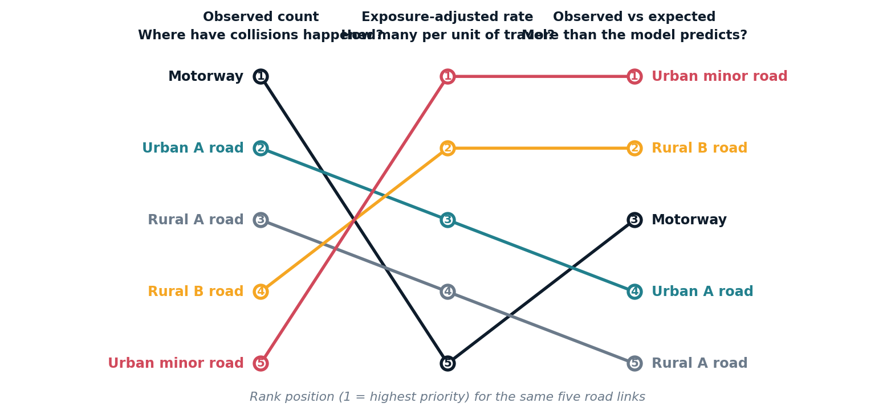
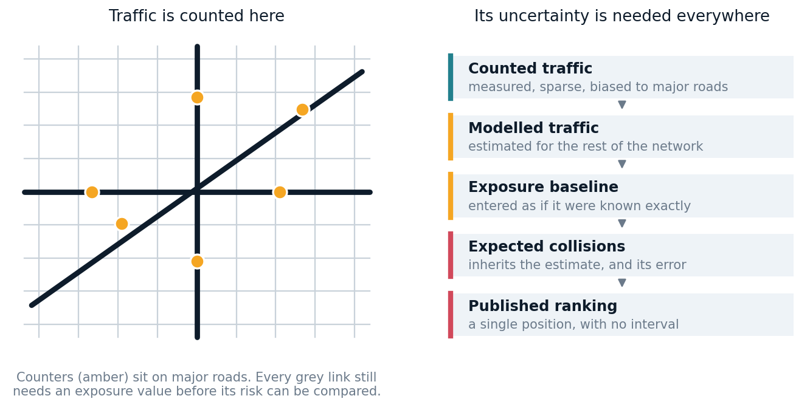
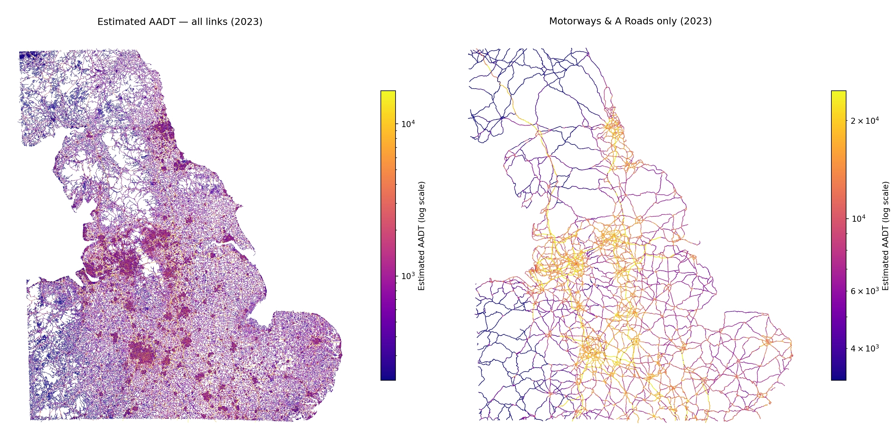
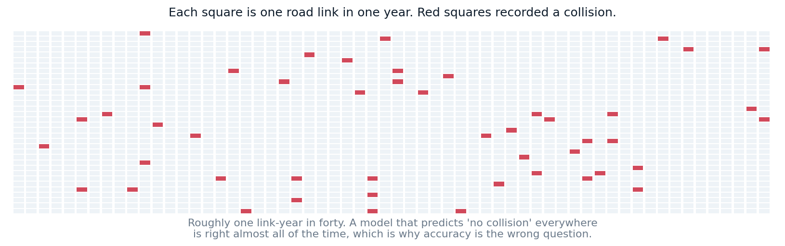
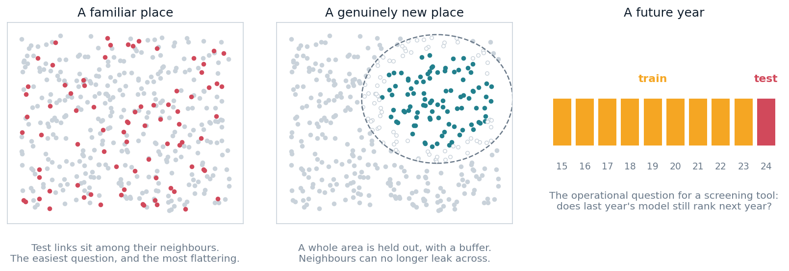
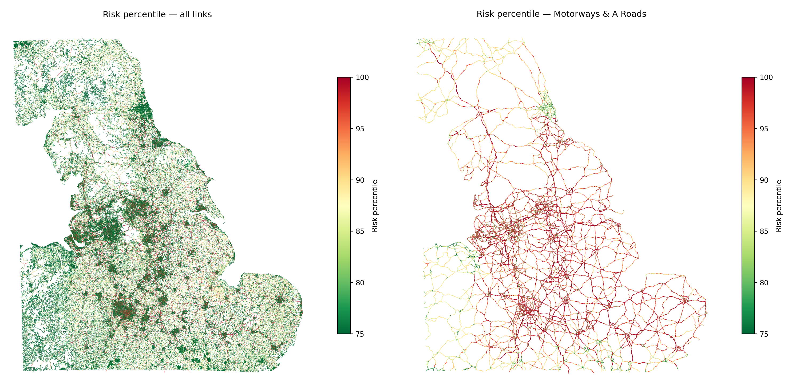

::: {.small .text-muted}
This page is the overview argument. Every claim links down to the page that owns
the evidence. For current model figures at render time, see
[Model Status](project/model-status.qmd).
:::

A road-risk map can look deceptively simple. Colour the network from low to high,
give every segment a percentile, and let people find the places worth looking at.

Underneath that interface sits a much harder question: **what do we mean by risk?**

A road can carry many collisions because it is dangerous, because it is busy,
because it is long, or because of some combination of the three. A model that
does not separate those interpretations can produce a technically valid
prediction that is confidently misread.

Open Road Risk is an open-data pipeline for estimating exposure-adjusted
collision risk across the Great Britain road network. Building it has been less
an exercise in model selection than a long argument about what is being
estimated, what the data can support, and where a ranking stops being evidence
and starts being a decision.

## Start with the estimand

Three quantities appear constantly in road-safety analysis, and they are not
interchangeable.

**Observed collision count** — how many collisions were recorded on this road?
**Exposure-adjusted rate** — how many occurred per unit of traffic and length?
**Modelled expected count** — how many does a model expect, given exposure and
the character of the road and its surroundings?

The distinction is not academic. A road with ten collisions per million
vehicle-kilometres is a very different object from one with ten per hundred
million. A short street with a high rate may contribute far less total burden
than a long, heavily-travelled road with a lower one.

{fig-alt="Bump chart showing five road links changing rank position across three estimands: observed count, exposure-adjusted rate, and observed versus expected."}

The motorway is first by observed count and last by rate. The urban minor road
is last by count and first by rate. Both orderings are correct. They answer
different questions.

Open Road Risk models the expected collision count for each road-link year. In
simplified form:

> expected collisions = exposure baseline × contextual adjustment

Exposure is built from estimated traffic, link length and time. The contextual
adjustment uses features describing the road, its position in the network, the
surrounding area and the year. The full specification is on the
[modelling methodology](methodology/modelling.qmd) page.

One detail matters more than any other, and it is easy to miss: the published
percentile ranks links by their **mean predicted collision count**. It is an
expected-burden ranking. It is not a measure of intrinsic danger with traffic and
length removed.

A busy urban A road can rank highly because a great many vehicles travel along
it, even if its collision rate is unremarkable. That does not make the prediction
wrong. It changes what the output is for.

A mature public analytical product would publish several explicitly labelled
views rather than one: expected burden, crude exposure-adjusted rate,
observed-to-expected history, and rankings within comparable road families. No
single ordering answers every road-safety question, and choosing one silently
turns an analytical decision into a product default.

## Exposure is necessary, and partly modelled

Exposure is central to the whole analysis, and it is not observed.

Official traffic counts are concentrated at monitoring locations on major roads.
Collision records, by contrast, exist across the entire network. That asymmetry
is the structural problem the pipeline exists to solve: collisions are observed
widely, exposure is observed narrowly, and fair comparison needs both.

{fig-alt="Two panels: a schematic road network with traffic counters only on major roads, and a five-step chain showing exposure uncertainty flowing into the published ranking."}

The project handles this in two stages: a model of annual average daily traffic
at monitored count points, and a transfer of that information across the wider
network. Details are on the [AADF traffic counts](data-sources/aadf.qmd) page,
and the decision to train only on directly counted observations — rather than on
the published interpolations — is recorded in its
[own investigation](investigations/aadf-counted-only-filter.qmd).

The spatial holdout result is genuine evidence that the model generalises beyond
nearby observations. It is not an accuracy guarantee. Monitoring locations are
not a random sample of roads; major roads are far better represented than minor
and local ones. Error should be expected to grow with distance from a counter and
in road families where counters are scarce — which is to say, precisely where the
model is doing the most work.

This produces a methodological principle worth stating plainly:

> Uncertainty in an upstream model does not disappear when its prediction becomes
> an input to a downstream one.

At present that uncertainty is not propagated. The exposure estimate enters the
collision model as though it were measured, and the published ranking carries no
interval. Quantifying that propagation — or at minimum reporting performance by
distance from counters and by road class — is the single largest outstanding
correction, and it is tracked in [Future Work](future-work.qmd).

{fig-alt="Modelled traffic exposure across the Great Britain road network."}

## Sparse counts need count-model thinking

The outcome is extremely sparse. The overwhelming majority of road-link years
contain no recorded collision at all.

{fig-alt="Grid of squares, the vast majority empty, with a small scattering of filled squares representing link-years with a recorded collision."}

That shape drives most of the modelling decisions. Ordinary least squares can
estimate a conditional mean under some assumptions, but it is a poor default
here: it will happily predict negative collisions, it assumes an error structure
the data does not have, and its loss function concentrates attention on the rare
high-count tail rather than the zero-heavy bulk where the decision-relevant
signal lives.

Poisson regression is the natural starting point, because it models non-negative
counts directly. Its central assumption is that conditional variance equals
conditional mean — and road collision data routinely violate it. Differences
between roads, unobserved behaviour, weather and temporary conditions all create
more variance than a Poisson model expects. The literature on this is summarised
on the [crash frequency models](literature/crash-frequency-models.qmd) page.

Rather than inherit that conclusion, the project tested it. A
[zero-calibration diagnostic](investigations/zero-calibration.qmd) simulated
from the fitted model and compared the number of zeros it produced against the
number actually observed. The Poisson specification fell short by a small but
overwhelmingly significant margin; a negative binomial closed the gap without any
zero-inflation component.

That is good evidence for promoting negative binomial to the next comparison. It
is not evidence that it has already won. Matching the zero count tests one part
of the distribution. The models still need comparing on the same held-out rows,
using count deviance, calibration across the range, ranking behaviour and
operational selection criteria.

## One headline metric is not enough

The repository reports results from more than one modelling surface — an
interpretable GLM on a downsampled table, and a gradient-boosted model on the
full population with its natural zero rate.

It is tempting to read those two numbers against each other. It would be
misleading. They are computed on different populations, with different zero
rates, different splits and different null models. The gap between them is
mostly a property of the evaluation surfaces, not of the models.

```{python}
#| echo: false
#| output: asis

import json
from pathlib import Path


def find_data_root():
    cwd = Path.cwd().resolve()
    for c in [cwd, *cwd.parents]:
        if (c / "data/models/collision_metrics.json").exists():
            return c
    return None


root = find_data_root()
rendered = False

if root is not None:
    try:
        with open(root / "data/models/collision_metrics.json") as f:
            coll = json.load(f)
        glm = coll.get("glm", {})
        xgb = coll.get("xgb", {})
        glm_r2 = glm.get("pseudo_r2")
        xgb_r2 = xgb.get("pseudo_r2")
        if glm_r2 is not None and xgb_r2 is not None:
            print(
                "> **At render time**, the GLM reports a pseudo-R² of "
                f"`{glm_r2:.3f}` on its downsampled in-sample surface, and the "
                f"gradient-boosted model `{xgb_r2:.3f}` out-of-sample against "
                "the real zero rate. These are read from "
                "`collision_metrics.json` rather than typed, and they are not "
                "comparable to one another.\n"
            )
            rendered = True
    except Exception:
        rendered = False

if not rendered:
    print(
        "> Current figures for both models are read from the model artefacts on "
        "the [Model Status](project/model-status.qmd) page.\n"
    )
```

A fair comparison would require one frozen link-year dataset, one shared
train/test definition, the same exposure assumptions, the same null model, the
same metric implementation, and results broken out by road family and geography.
This sounds procedural. It is fundamental: model comparison only means anything
when the evaluation surface is held constant.

The same discipline applies to knowing when *not* to adopt something. The project
sets adoption thresholds before running a test, using a
[rank-stability harness](investigations/rank-stability.qmd) to establish how much
of a metric movement is simply random-seed variation. One candidate feature set
produced a real, consistently measured improvement that nonetheless sat below
that threshold, and was
[parked rather than shipped](investigations/temporal-descriptors.qmd).

## Spatial validation changes the question

Random train–test splits are optimistic for spatial data. Neighbouring road links
share traffic, design, network function and surrounding context. Holding out
individual links stops repeated years of the same link leaking across the split —
the obvious leak — but adjacent links can still make the test set unusually
familiar.

{fig-alt="Three panels showing a random spatial split, a buffered spatial block holdout, and a leave-last-year-out temporal split."}

Three questions need keeping apart: can the model predict another observation in
a familiar area, can it predict a genuinely new place, and can it predict a
future year? They need different schemes, and the
[spatial methods](literature/spatial-methods-and-network-risk.qmd) literature is
clear that the answers differ substantially.

Performance will very probably fall under the harder tests. That decline is not a
failure — it is the measurement. It tells you how far the model can safely travel
from the context it was trained in, which is exactly what a screening tool needs
to state.

## Rankings are decisions, not just predictions

Look at the composition of the current top 1% and it is dominated by A roads and
by urban links. That is entirely plausible for an expected-burden ranking: busy,
long, urban roads carry more traffic and contribute a larger share of total
collisions. The current breakdown is on the
[model results](analysis/model-results.qmd) page.

{fig-alt="Modelled collision risk across the Great Britain road network."}

But composition is not evidence of value. It describes the portfolio that was
selected; it says nothing about how much the model added. To establish that, the
ranking needs comparing against a deliberately naive alternative:

- How much of the top 1% would an exposure-only ranking have selected anyway?
- How many subsequent collisions does each approach capture?
- Does the model add anything *within* comparable road families?
- How stable is the selected set between years and between estimators?
- Which links appear only because of contextual features?

That exposure-only baseline has not yet been run, and it is the cheapest
informative experiment available to the project.

The choice of estimator matters just as much. An
[empirical Bayes](methodology/empirical-bayes-shrinkage.qmd) adjustment — which
combines the model's expectation with observed history and shrinks unstable
observations — produced a top-1% list that shared well under half its membership
with the unadjusted ranking on an earlier England-scale run.

Neither is wrong. They answer subtly different questions. But a difference that
large belongs in the model contract, stated prominently, rather than sitting as
an implementation detail that a downstream user has no way to see.

## Literature should guide interpretation, not supply a ceiling

Road-safety research consistently finds that collisions arise from interacting
behavioural, environmental, vehicle and infrastructure factors. A model built
mainly from road and area characteristics necessarily omits the transient ones:
driver behaviour, weather, momentary traffic conditions, individual interactions.

Limited predictive power is therefore expected, and chasing it with more features
is more likely to import leakage than signal — a lesson this project learned the
expensive way, and
[documented rather than quietly corrected](analysis/model-results.qmd).

That expectation should not harden into a fixed numerical ceiling. Metrics from
binary crash prediction, causal studies and link-year count models are not
interchangeable, and a result should not be declared impossible because it
exceeds a number reported for a different task. The literature is most useful
here as a guide to omitted variables, a warning about spatially optimistic
validation, a source of plausible mechanisms and a framework for external
checks — which is how the
[evidence register](literature/validation-and-metrics.qmd) treats it.

## What credible external validation would look like

Correlation with an independent road-safety rating would be useful convergent
evidence. It would not, on its own, validate the model — the two systems are
estimating different things.

A serious programme has layers:

1. **Internal correctness** — joins, schemas, feature timing, reproducible runs.
2. **Statistical adequacy** — calibration, residuals, spatial and temporal transfer.
3. **Convergent validity** — agreement with independent engineering assessment.
4. **Predictive validity** — do highly-ranked links see more collisions in held-out years?

Layers 1 and 2 are within the project's control and partly done. Layers 3 and 4
require independent data access or a partner, which makes them the genuine
bottleneck. Every internal diagnostic compares the model to itself: to other
seeds, to another estimator, to its own residuals. None of them can detect an
error shared across all of those.

## The next experiment

The most informative next step is not another feature. It is a common evaluation
surface.

On one frozen dataset with shared holdouts, compare an exposure-only baseline, a
Poisson GLM, a negative binomial GLM, the boosted model and the empirical Bayes
alternative — scoring all of them with the same deviance, the same calibration
checks, top-k capture, lift over exposure alone, ranking stability and
performance by geography and road family. Adoption criteria defined before the
results are seen.

One programme, several currently-tangled questions answered at once: Poisson
versus negative binomial, interpretable model versus boosting, global prediction
versus empirical Bayes, and model signal versus exposure alone.

## A model is more than its algorithm

The clearest lesson from this project is that credibility does not come from
model complexity.

It comes from being precise about the quantity being predicted, honest about
where uncertainty enters, disciplined about evaluation surfaces, and explicit
about how a ranking should and should not be used.

A useful road-risk model helps identify candidates for investigation. It is not
an engineering diagnosis, not a causal explanation, and not a statement that one
road is inherently more dangerous than another.

That distinction is not a disclaimer bolted on after the modelling.

It is part of the model.

---

## Where to go next

- [Model Status](project/model-status.qmd) — current figures, read from the model artefacts at render time
- [Model Results](analysis/model-results.qmd) — performance, residuals, risk distribution and maps
- [Investigations](investigations/index.qmd) — diagnostics and negative results, including what was tested and rejected
- [Methodology](methodology/methodology-index.qmd) — how the sources become modelling inputs, including the [collision-to-link join](methodology/data-joining.qmd)
- [Literature](literature/literature-index.qmd) — what the field expects, and where this project departs from it
- [Future Work](future-work.qmd) — the open questions, in rough order of evidence gained per unit of effort

::: {.small .text-muted}
Open Road Risk is an independent personal research and software project. It uses
public and open datasets and is not produced by, endorsed by, or representative
of DfT, National Highways, Ordnance Survey, the Office for National Statistics or
any other public body. The figures on this page are either read from model
artefacts at render time or linked to the page that owns them; illustrative
figures are labelled as such.
:::
